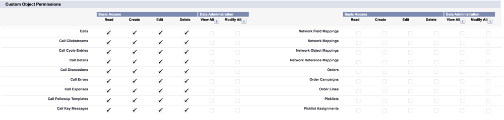

# 步驟2之3：建立Marketo Engage的[!DNL Veeva] CRM使用者 {#step-2-of-3-create-a-veeva-crm-user-for-marketo-engage}

>[!NOTE]
>
>本文中的步驟必須由[!DNL Veeva] CRM管理員完成。

>[!PREREQUISITES]
>
>[步驟3之1：將Marketo欄位新增至 [!DNL Salesforce] （專業）](/help/marketo/product-docs/crm-sync/veeva-crm-sync/setup/step-1-of-3-add-marketo-fields-to-veeva-crm.md){target="_blank"}

在本文中，您將使用[!DNL Veeva] CRM頁面配置來自訂欄位許可權，並建立[!DNL Marketo-Veeva] CRM同步使用者。

## 設定頁面配置 {#set-page-layouts}

按照以下步驟操作將允許Marketo同步使用者更新自訂欄位。

1. 按一下導覽搜尋列中的&#x200B;**[!UICONTROL Account]** （個人帳戶）頁面配置，而不按Enter，然後按一下&#x200B;**[!UICONTROL Page Layout]**&#x200B;底下的[!UICONTROL Contacts]。

   

1. 按一下「**[!UICONTROL Page Layouts]**」。

   

1. 按一下「**[!UICONTROL HCP - Professional]**」。

   

1. 按一下並將新&#x200B;**[!UICONTROL Section]**&#x200B;拖曳到版面配置中。

1. 輸入&#x200B;**[!UICONTROL Section Name]**&#x200B;的「Marketo」並按一下&#x200B;**[!UICONTROL OK]**。

   

1. 按一下「**[!UICONTROL Score]**」欄位並拖曳至Marketo區段。

   

1. 對下列欄位重複上述步驟：

   * 推斷的城市
   * 推斷公司
   * 推斷國家
   * 推斷的大都會區
   * 推斷的電話區碼
   * 推斷的郵遞區號
   * 推斷的州別區域

   >[!NOTE]
   >
   >這些欄位必須位於頁面配置中，Marketo才能讀取/寫入這些欄位。

   >[!TIP]
   >
   >向下拖曳至頁面右側，為欄位建立兩欄。 您可以將欄位從一側移動到另一側，以平衡欄長度。

1. 完成[!UICONTROL HCP-Professional]配置後，按一下&#x200B;**[!UICONTROL Save]**。

   

>[!NOTE]
>
>對其他[!UICONTROL Account]個頁面配置重複此步驟。

## 建立設定檔 {#create-a-profile}

1. 按一下「**[!UICONTROL Setup]**」。

   

1. 在導覽搜尋列中輸入「設定檔」並按一下&#x200B;**[!UICONTROL Profiles]**&#x200B;連結。

   

1. 按一下「**[!UICONTROL New]**」。

   

1. 選取&#x200B;**[!UICONTROL Standard User]**，將設定檔命名為&quot;[!UICONTROL Marketo-Salesforce Sync]&quot;，然後按一下&#x200B;**[!UICONTROL Save]**。

   

## 設定設定檔許可權 {#set-profile-permissions}

1. 按一下&#x200B;**[!UICONTROL Edit]**&#x200B;以設定安全性許可權。

   

1. 在[!UICONTROL Administrative Permissions]區段下，確定已選取[!UICONTROL API Enabled]。

   

   >[!TIP]
   >
   >請務必勾選[!UICONTROL Password Never Expires]方塊。

1. 在[!UICONTROL General User Permissions]區段下，確定已選取[!UICONTROL Edit Events]和[!UICONTROL Edit Tasks]。

   

1. 在[!UICONTROL Standard Object Permissions]區段下，確定已檢查[!UICONTROL Read]與[!UICONTROL Create]的[!UICONTROL Edit]、[!UICONTROL Delete]、[!UICONTROL Accounts]與[!UICONTROL Contacts]許可權。

   

1. 在[!UICONTROL Custom Object Permissions]區段下，確定已針對[!UICONTROL Read]、[!UICONTROL Call]和其他任何需要的自訂物件檢查[!UICONTROL Call Key Message]許可權。

   

1. 完成後，按一下頁面底部的&#x200B;**[!UICONTROL Save]**。

   

## 設定欄位許可權 {#set-field-permissions}

1. 與您的行銷人員討論，找出同步所需的自訂欄位。

   >[!NOTE]
   >
   >此步驟將防止您不需要的欄位顯示在Marketo中，這將減少雜亂並加快同步速度。

1. 在[!UICONTROL profile detail]頁面中，移至&#x200B;**[!UICONTROL Field-Level Security]**&#x200B;區段。 按一下&#x200B;**[!UICONTROL View]**&#x200B;編輯[!UICONTROL Contact]和[!UICONTROL Account]物件的協助工具。

   

   >[!TIP]
   >
   >您可以根據組織的需求設定其他物件。

1. 按一下每個物件的&#x200B;**[!UICONTROL Edit]**。

   

找出不必要的欄位，確定[!UICONTROL Read Access]和[!UICONTROL Edit Access]已&#x200B;**取消勾選**。 完成時，按一下&#x200B;**[!UICONTROL Save]**。

>[!NOTE]
>
>僅編輯自訂欄位的協助工具。

1. 在您停用完所有不必要的欄位後，請檢查[!UICONTROL Read Access]和[!UICONTROL Edit Access]下列物件欄位。 完成時，按一下&#x200B;**[!UICONTROL Save]**。

<table>
 <tbody>
  <tr>
   <th>物件
   <th>欄位
  </tr>
  <tr>
   <td>帳戶</td>
   <td>型別欄位</td>
  </tr>
  <tr>
   <td>活動</td>
   <td>所有欄位</td>
  </tr>
  <tr>
   <td>任務</td>
   <td>所有欄位</td>
  </tr>
 </tbody>
</table>

## 建立同步使用者 {#create-sync-user}

Marketo需要認證才能存取[!DNL Veeva] CRM。 建議您先透過下列步驟建立專屬使用者，再完成這項工作。

>[!NOTE]
>
>如果您的組織沒有其他[!DNL Veeva] CRM授權，您可以使用具有系統管理員設定檔的現有行銷使用者。

1. 在導覽搜尋列中輸入「使用者」，然後按一下&#x200B;**[!UICONTROL Users]**&#x200B;下方的[!UICONTROL Manage Users]。

   

1. 按一下「**[!UICONTROL New User]**」。

   

1. 填寫必填欄位，選取&#x200B;**[!UICONTROL User License]**： **[!UICONTROL Salesforce]**，設定&#x200B;**[!UICONTROL Profile]**： **[!UICONTROL Marketo Sync]**&#x200B;使用者，然後按一下&#x200B;**[!UICONTROL Save]**。

   

>[!TIP]
>
>請確定您輸入的電子郵件地址有效。 您必須以同步處理使用者身分登入，才能重設密碼。

太好了！ 現在您已擁有Marketo Engage可用來連線至[!DNL Veeva] CRM的帳戶。 開始吧。

>[!MORELIKETHIS]
>
>[步驟3之3：連線Marketo和 [!DNL Veeva] CRM](/help/marketo/product-docs/crm-sync/veeva-crm-sync/setup/step-3-of-3-connect-marketo-engage-and-veeva-crm.md){target="_blank"}
