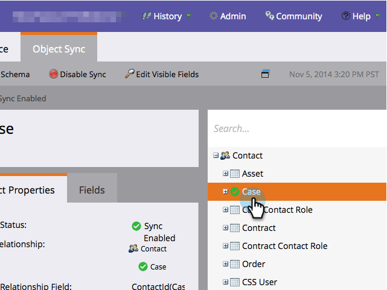

# 新增/移除自訂物件欄位做為智慧清單/觸發條件約束 {#add-remove-custom-object-field-as-smart-list-trigger-constraints}

Marketo Engage提供對Veeva自訂物件同步的特定控制。 這可讓您選取可在自訂物件篩選器中作為限制條件的欄位，並在Smart Campaigns中將其用作觸發器。

>[!NOTE]
>
>**需要管理員許可權**

1. 按一下 **管理員**，然後 **Veeva物件同步**.

   

1. 選取您要修改的物件。

   

1. 按一下 **編輯可見欄位**.

   

   >[!TIP]
   >
   >如果「編輯可見欄位」按鈕呈現灰色，表示該物件目前正在智慧清單或智慧行銷活動中使用。 移除所有關聯以繼續。

1. 如果您的全域同步已啟用，請按一下 **停用全域同步**.

   

1. 勾選所需的篩選/觸發條件限制旁的方塊，然後按一下 **儲存**.

   

   >[!NOTE]
   >
   >依預設，選取所有欄位作為篩選條件上的限制。

1. 按一下「欄位」標籤以確認變更。

   

>[!IMPORTANT]
>
>別忘了重新啟用您的全域同步處理！

現在，您的智慧清單和智慧行銷活動甚至擁有更多功能。

>[!MORELIKETHIS]
>
>[啟用/停用自訂物件同步](/help/marketo/product-docs/crm-sync/veeva-crm-sync/sync-details/enable-disable-custom-object-sync.md){target="_blank"}
