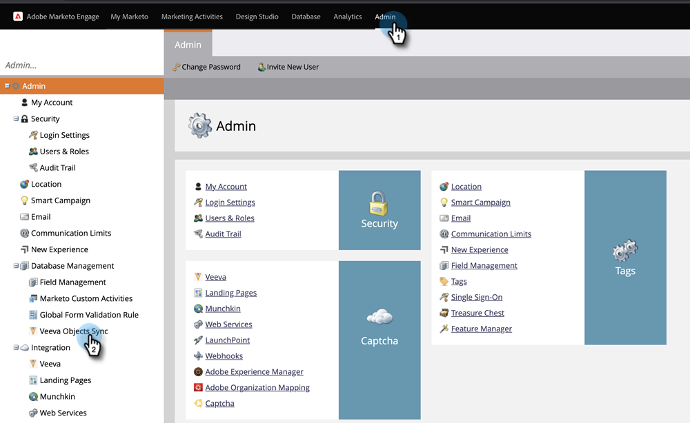

# 添加/刪除自定義對象欄位作為智慧清單/觸發器約束 {#add-remove-custom-object-field-as-smart-list-trigger-constraints}

Marketo Engage提供對Veva自定義對象同步的特定控制。 這允許您選擇自定義對象篩選器中可用作約束的欄位，並將它們用作智慧市場活動中的觸發器。

>[!NOTE]
>
>**需要管理權限**

1. 按一下 **管理**，則 **Veeva對象同步**。

   

1. 選擇要修改的對象。

   

1. 按一下 **編輯可見欄位**。

   

   >[!TIP]
   >
   >如果「編輯可見欄位」按鈕呈灰色顯示，則該對象當前正在智慧清單或智慧市場活動中使用。 刪除所有關聯以繼續。

1. 如果啟用了全局同步，請按一下 **禁用全局同步**。

   

1. 選中所需過濾器/觸發器約束旁邊的框，然後按一下 **保存**。

   

   >[!NOTE]
   >
   >預設情況下，所有欄位都被選為篩選器的約束。

1. 按一下「欄位」(Fields)頁籤以確認更改。

   

>[!IMPORTANT]
>
>不要忘記重新啟用全局同步！

現在，你的智慧清單和智慧營銷活動的威力更大了。

>[!MORELIKETHIS]
>
>[啟用/禁用自定義對象同步](/help/marketo/product-docs/crm-sync/veeva-crm-sync/sync-details/enable-disable-custom-object-sync.md){target=&quot;_blank&quot;
