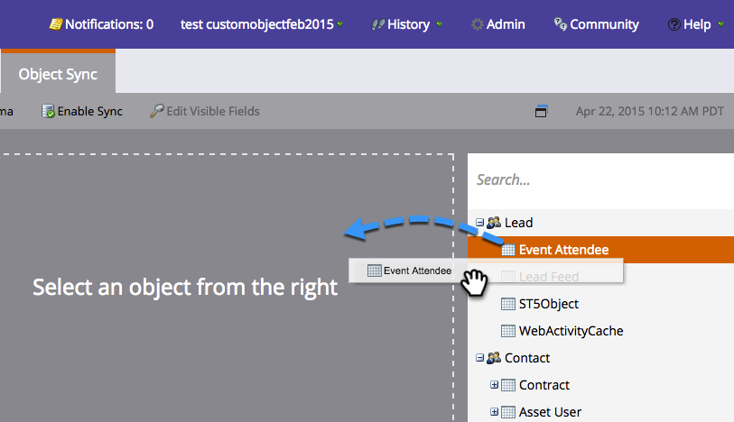

# 自定義對象同步 {#custom-object-sync}

在您的Veeva CRM實例中建立的自定義對象也可以是Marketo Engage的一部分。 下面是如何設定。

>[!NOTE]
>
>**需要管理權限**

>[!PREREQUISITES]
>
>要使用自定義對象，它必須與Veeva CRM中的聯繫人或帳戶對象關聯。

## 啟用自定義對象 {#enable-custom-object}

1. 在Marketo，按一下 **管理**，則 **Veeva對象同步**。

   

1. 如果這是您的第一個自定義對象，請按一下 **同步架構**。

   

1. 按一下 **禁用全局同步**。

   

   >[!NOTE]
   >
   >Veva自定義對象架構的初始同步可能需要幾分鐘時間。

1. 將要同步的自定義對象拖到畫布中。

   

   >[!NOTE]
   >
   >自定義對象必須具有唯一的名稱。 Marketo不支援兩個同名的不同自定義對象。

1. 按一下 **啟用同步**。

   

1. 按一下 **啟用同步** 的雙曲餘切值。

   

1. 返回 **韋瓦** 頁籤。

   

1. 按一下 **啟用同步**。

   

1. 要查看所有Veeva自定義對象，請按一下「管理」和「Veeva對象同步」。

   

   >[!NOTE]
   >
   >Marketo僅支援與標準實體連結的一到兩級深的定製實體。

太棒了！ 您現在可以在智慧市場活動和智慧清單中使用來自此自定義對象的資料。

>[!MORELIKETHIS]
>
>* [同步呼叫和呼叫密鑰消息](/help/marketo/product-docs/crm-sync/veeva-crm-sync/sync-details/syncing-call-and-call-key-messages.md){target=&quot;_blank&quot;
>* [添加/刪除自定義對象欄位作為智慧清單/觸發器約束](/help/marketo/product-docs/crm-sync/veeva-crm-sync/sync-details/add-remove-custom-object-field-as-smart-list-trigger-constraints.md){target=&quot;_blank&quot;

