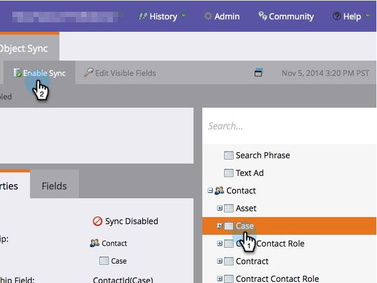

# 啟用/禁用自定義對象同步 {#enable-disable-custom-object-sync}

在您的Veeva CRM實例中建立的自定義對象也可以是Marketo Engage的一部分。 下面是如何設定。

## 啟用或禁用自定義對象同步 {#enable-or-disable-the-custom-object-sync}

>[!NOTE]
>
>**需要管理權限**

1. 在Marketo，按一下 **管理**，則 **Veeva對象同步**。

   

1. 如果這是您的第一個自定義對象，請按一下「同步架構」。 否則，按一下 **刷新架構** 確保你有最新的。

   

1. 如果全局同步正在運行，請按一下 **禁用全局同步**。

   

   >[!NOTE]
   >
   >Veeva自定義對象架構的同步可能需要幾分鐘時間。

1. 按一下 **刷新架構**。

   

選擇要同步的對象，然後按一下啟用同步。

>[!TIP]
>
>Marketo只有與Veeva CRM中的Contact或Account對象有直接關係時，才能同步自定義對象。

1. 按一下 **啟用同步** 的雙曲餘切值。

   

1. 返回到Veeva頁籤，然後按一下 **啟用同步**。

   

## 使用自定義對象 {#using-your-custom-objects}

>[!NOTE]
>
>您不能在具有觸發器的智慧市場活動中使用自定義對象。

1. 在您的Smart List中，拖到「Has Opportunity」過濾器並設定為 **真**。

   

1. （可選）使用篩選器約束來縮小焦點。

   

太棒了！ 您現在可以在智慧市場活動和智慧清單中使用此自定義對象的資料。

>[!MORELIKETHIS]
>
>[添加/刪除自定義對象欄位作為智慧清單/觸發器約束](/help/marketo/product-docs/crm-sync/veeva-crm-sync/sync-details/add-remove-custom-object-field-as-smart-list-trigger-constraints.md){target=&quot;_blank&quot;
