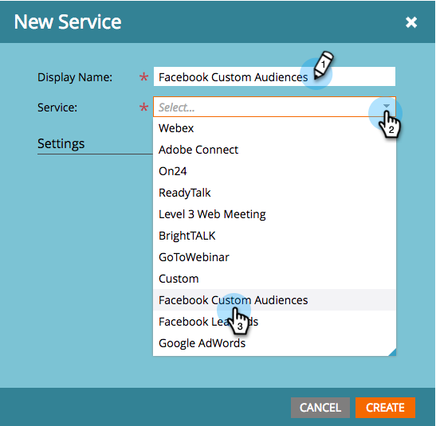
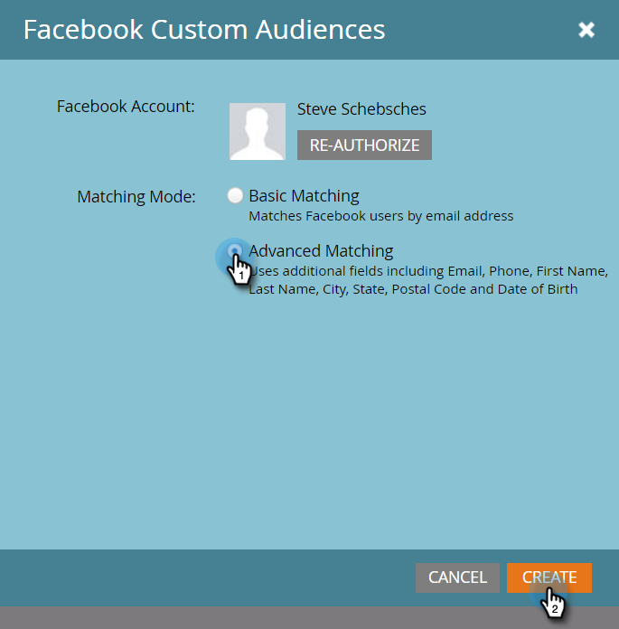

# 新增Facebook自訂對象為LaunchPoint服務{#add-facebook-custom-audiences-as-a-launchpoint-service}

>[!NOTE]
>
>**需要管理員權限**

透過此整合，您可以將觀眾資料從Marketing傳送至靜態和智慧型清單至Facebook，以用作Facebook廣告促銷活動中的自訂觀眾。 這是如何設定的。

1. 前往Marketo **Admin**。

   

1. 前往&#x200B;**LaunchPoint**，按一下&#x200B;**New**，然後選取&#x200B;**New Service**。

   

1. 為您的服務輸入&#x200B;**顯示名稱**&#x200B;並從&#x200B;**服務**&#x200B;下拉式清單中選取&#x200B;**Facebook自訂對象**&#x200B;服務。

   

1. 在相同的瀏覽器中開啟新標籤，並前往[facebook.com](https://www.facebook.com/)。 使用您要用於整合的帳戶登入Facebook。

   >[!CAUTION]
   >
   >為了讓Market在多個廣告管理員帳戶間傳送觀眾，您依下列步驟授權的Facebook使用者必須擁有這些帳戶的&#x200B;*all*&#x200B;存取權。

   

1. 登入Facebook後，請返回Marketo。 按一下&#x200B;**授權**。

   

   >[!NOTE]
   >
   >您&#x200B;_必須_&#x200B;使用Facebook Business Manager帳戶，才能讓「自訂對象」整合運作。 要瞭解如何設定Business Manager帳戶，請參閱[Facebook說明](https://www.facebook.com/business/help/1710077379203657)。

1. 如果出現提示，請按一下&#x200B;**OK**&#x200B;接受Marketo應用程式安裝至Facebook。

   

1. 你現在被授權了！ 選擇匹配模式，然後按一下&#x200B;**建立**。

   >[!NOTE]
   >
   >**基本** 匹配僅使用電子郵件地址。**進階** 比對使用另外7個欄位，可提高比對率，以進行更多轉換。不過，如果貴公司的隱私權政策不允許共用其他欄位，或者您的資料未包含欄位，請選取「基本符合」。

   

   幹得好！ 您現在可以移至Market中的任何靜態或智慧型清單，並傳送觀眾資料至Facebook。

   >[!CAUTION]
   >
   >哦，在您前往之前，請務必在您的Facebook帳戶中[接受Facebook的自訂對象條款](https://www.facebook.com/ads/manage/customaudiences/tos.php)! 若不這麼做，觀眾更新將會失敗。

>[!MORELIKETHIS]
>
>* [在Facebook中建立自訂對象](/help/marketo/product-docs/demand-generation/facebook/create-a-custom-audience-in-facebook.md)
   >
   >
* [設定Facebook銷售線索廣告](/help/marketo/product-docs/demand-generation/facebook/set-up-facebook-lead-ads.md)

