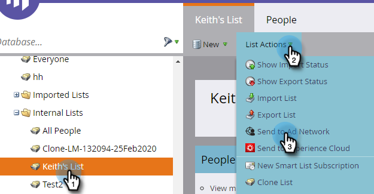

# 傳送清單至廣告網路 {#send-a-list-to-an-ad-network}

了解如何將靜態清單傳送至LinkedIn、Facebook或Google。

## 如何傳送清單 {#how-to-send-a-list}

1. 在Marketo中，選取您的清單，按一下 **清單動作** 下拉式清單，然後選取 **傳送至廣告網路**.

   

1. 在LinkedIn、Facebook或Google之間選擇（其他選項目前無法使用）。 在這個例子中，我們選擇 **linkedIn**. 按一下 **下一個**.

   

1. 按一下「對象」下拉式清單，然後選取您想要的對象。

   

   >[!TIP]
   >
   >如果您需要檢查，可以透過「狀態」標籤查看同步清單的目標對象。

1. 選擇您想要的推送類型，然後按一下 **更新**.

   

   >[!NOTE]
   >
   >如果您選取「啟用持續的受眾同步」，Marketo會隨著Marketo例項中的清單變更，讓所選廣告網路中的清單保持最新。 我們都加了 **和** 將人員新增至靜態清單中/從靜態清單中移除時，請將其從對象中移除。

1. 就這樣！ 按一下 **確定** 退出。

   

## 常見問題集 {#faq}

**可以將單一靜態清單與多個廣告對象同步嗎？**

否，清單只能同步至單一目的地對象。

**如果我啟用與現有廣告對象的持續同步，會取代現有對象嗎？**

否，會將現有對象新增至，而非取代。
