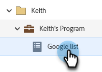

# 傳送清單至 Google {#send-a-list-to-google}

若是使用Google Customer Match的使用者，請遵循下列步驟，將Marketo Engage靜態清單傳送至您的Google帳戶。

1. 在Marketo Engage中，尋找並選取所需的清單。

   

1. 按一下&#x200B;**清單動作**&#x200B;下拉式清單，然後選取&#x200B;**傳送至廣告網路**。

   

1. 選擇Google並按一下&#x200B;**下一步**。

   

1. 選擇您需要的廣告帳戶。 您可以選擇現有對象或建立新對象。 在此範例中，我們正在建立新範本。 為您的新對象命名。

   

1. 進行您的選擇性。

   

   >[!NOTE]
   >
   >* 選取&#x200B;**保持對象成員資格同步**，讓清單在您的執行個體中變更時保持最新狀態。 我們會在將人員新增至靜態清單/從靜態清單中移除時，在對象中新增/移除人員。
   >
   >* 選取底部的核取方塊會針對傳送至Google Ads以用於廣告和廣告個人化的使用者資料，將同意狀態傳送為GRANTED。 若未勾選，則會將同意狀態傳送為「未指定」 。 對於計畫為歐洲經濟區(EEA)的使用者上傳資料的使用者，Google已收集[常見問題集](https://support.google.com/google-ads/answer/14310715){target="_blank"}的清單，以及概述[EU使用者同意政策](https://www.google.com/about/company/user-consent-policy/){target="_blank"}的其他詳細資訊。

1. 按一下&#x200B;**更新**。

   

1. 按一下&#x200B;**[確定]**&#x200B;結束。

   
