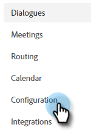

# 對話方塊概述 {#dialogue-overview}

對話方塊是個別的聊天對話方塊。 在每個對話方塊中，您會決定顯示特定聊天對話的位置、顯示對象以及對話的內容。 每個對話方塊都有自己的報告頁面，您可以在其中監控成效。

## 對象條件 {#audience-criteria}

此 [對象條件](/help/marketo/product-docs/demand-generation/dynamic-chat/dialogues/audience-criteria.md){target="_blank"} 對話方塊的區段是您定義聊天對話顯示位置與對象的位置

## 流程設計工具 {#stream-designer}

此 [串流設計工具](/help/marketo/product-docs/demand-generation/dynamic-chat/dialogues/stream-designer.md){target="_blank"} 對話方塊的區段是設計要與網站訪客進行對話的位置。

## 報表 {#reports}

在「報表」索引標籤中，您可以檢視有關對話方塊執行狀況的量度。

## 停用/啟用所有對話方塊 {#disable-enable-all-dialogues}

您可以同時停用（及重新啟用）所有已發佈的對話方塊。

1. 在Dynamic Chat中，按一下 **設定** 標籤。

   

1. 切換 **聊天已啟用** 切換為關閉以停用（再切換為開啟以重新啟用）所有對話方塊。

   

