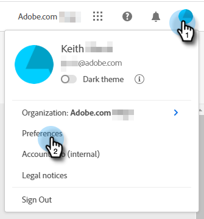

# Dynamic Chat概觀 {#dynamic-chat-overview}

Dynamic Chat可讓您運用易用的介面，將目標同時鎖定於造訪您網站的訪客和帳戶。 收集相關內容，例如姓名、聯絡資訊和任意文字。 網站訪客也可以預約與您的銷售團隊開會。 Dynamic Chat活動和參與資料可用來將成員新增至Marketo方案，並觸發跨頻道活動。

>[!TIP]
>
>造訪 [此頁面](https://experienceleague.adobe.com/docs/marketo-learn/tutorials/dynamic-chat/dynamic-chat-overview.html) 以檢視Dynamic Chat的教學課程影片。

## 整合 {#integrations}

Dynamic Chat的一個重要元件，是能夠與您的Marketo訂閱原生介面。 為了善用此整合的完整功能，您首先需要啟動資料同步。 根據Marketo資料庫的大小，初始的資料可能最多需要24小時的時間。 [一次性同步](/help/marketo/product-docs/demand-generation/dynamic-chat/integrations/connect-dynamic-chat-to-marketo.md) 完成。

以下專案已同步：

* 個人欄位資料
* 公司欄位資料
* 活動資料

## 對話 {#dialogues}

對話方塊代表單一聊天專案。 將其視為一個容器，其中包含您為網站訪客提供引人入勝的聊天對話方塊所需的所有內容。 在每個對話方塊中，您可以指定您希望對話方塊顯示的頁面、顯示的對象，以及對話方塊本身的內容和流程。 此外，您可以尋找量度，以檢視對話方塊的執行狀況。 [深入瞭解對話方塊](/help/marketo/product-docs/demand-generation/dynamic-chat/dialogues/dialogue-overview.md){target="_blank"}.

## 設定 {#configuration}

在「組態」標籤中，自訂各種對話方塊的外觀和風格。 變更字型、顏色、回應時間等！ [進一步瞭解設定](/help/marketo/product-docs/demand-generation/dynamic-chat/configuration.md){target="_blank"}.

## 行事曆 {#calendar}

連線您的Outlook或Gmail行事曆，以用於聊天機器人中的約會排程。 [深入瞭解行事曆](/help/marketo/product-docs/demand-generation/dynamic-chat/appointment-scheduling/calendar.md){target="_blank"}

## 會議 {#meetings}

您將在這裡看到網站訪客透過各種對話方塊排程的所有約會。 [進一步瞭解會議](/help/marketo/product-docs/demand-generation/dynamic-chat/appointment-scheduling/meetings.md){target="_blank"}

## 路由 {#routing}

您可以在此處檢視已連線其行事曆的所有代理程式清單、其向網站訪客呈現的順序，以及建立自訂路由規則。 [進一步瞭解路由](/help/marketo/product-docs/demand-generation/dynamic-chat/appointment-scheduling/routing.md){target="_blank"}

## 即時聊天 {#live-chat}

提供合格的網頁訪客，透過以下方式與您的銷售代表連絡： [即時交談](/help/marketo/product-docs/demand-generation/dynamic-chat-two/live-chat/agent-inbox.md){target="_blank"}.

## 常見問題集 {#faq}

**我可以在公司網站上的任何地方安裝Dynamic Chat，還是只能在Marketo登陸頁面上使用？**

Dynamic ChatJavaScript程式碼片段可安裝在任何網站以及Marketo登陸頁面上。

**資料會儲存多久以用於報告？**

90天。

**Dynamic Chat允許即時聊天嗎？**

不會，只會使用預先決定的回應。

**Dynamic Chat是否支援英語以外的任何語言？**

是. Dynamic Chat支援下列語言：法文、德文、日文、西班牙文、義大利文、巴西葡萄牙文、韓文、簡體中文和繁體中文。 進一步瞭解 [區段如下](#changing-the-language).

**您支援AI/NLP功能嗎？**

我們不支援AI/NLP功能。

**如何鎖定匿名人員？**

在對話方塊中，您需要使用 _個人電子郵件是空的_ 屬性。

## 變更語言 {#changing-the-language}

請依照下列步驟變更您的Dynamic Chat語言。

>[!IMPORTANT]
>
>在設定檔層級變更您的語言將會變更 _全部_ Experience Cloud應用程式，而不僅僅是Dynamic Chat。

1. 在您的Experience Cloud帳戶中，按一下設定圖示並選擇 **偏好設定**.

   

1. 按一下您電子郵件地址下的目前語言。

   

1. 選擇您的新語言（第二種語言為選用），然後按一下 **儲存**.

   

   >[!NOTE]
   >
   >有幾十種語言可供選擇，但Dynamic Chat僅支援下列語言：英文、法文、德文、日文、西班牙文、義大利文、巴西葡萄牙文、韓文、簡體中文和繁體中文。

當您更新語言時，除了您親自填入的字詞之外（例如資料流回應），應用程式本身中的所有內容都會變更。

## Dynamic Chat資料保留限制 {#dynamic-chat-data-retention-limits}

<table>
  <th>資料類型</th>
  <th>保留期間</th>
 <tr>
  <td>無任何參與的匿名銷售機會</td>
  <td>90天</td>
 </tr>
 <tr>
  <td>目標活動</td>
  <td>24個月</td>
 </tr>
 <tr>
  <td>檔案活動</td>
  <td>24個月</td>
 </tr>
 <tr>
  <td>與對話方塊活動互動</td>
  <td>90天</td>
 </tr>
 <tr>
  <td>會議預約活動</td>
  <td>24個月</td>
 </tr>
</table>
