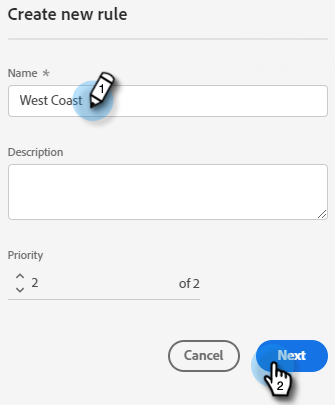

# 路由 {#routing}

以Dynamic Chat預約的會議可以兩種方式傳送。 循環配置資源，或使用自訂規則。

循環配置資源：會議會依序指派給代理程式。 因此，如果您有五個代理程式，而代理程式三參加最後一個會議，則代理程式四會取得下一個會議，接著是代理程式五，然後回到代理程式一。

自訂規則：您可以根據您選取的屬性選擇特定代理以接收會議。

## 建立自訂規則 {#create-a-custom-rule}

在此範例中，我們會將推斷的CA、OR和WA狀態的所有會議傳送給代理程式John。

1. 在「組態」底下，按一下 **路由規則**.

   

1. 按一下 **自訂規則** 標籤。

   

1. 按一下 **建立規則**.

   

1. 為規則命名。 您可以選擇新增說明並設定其優先順序層級。 按一下 **下一個**.

   

1. 選擇所需的代理程式。

   

1. 拖曳到您所需的屬性上。

   

1. 尋找並選取所需的值。

   

1. 選取所有所需值時，按一下 **儲存**.

   

## 帳戶路由 {#account-routing}

識別並上傳您的目標帳戶與個別銷售負責人，並將來自這些帳戶的訪客直接路由至個別帳戶負責人。

團隊路由

智慧清單路由的成員
