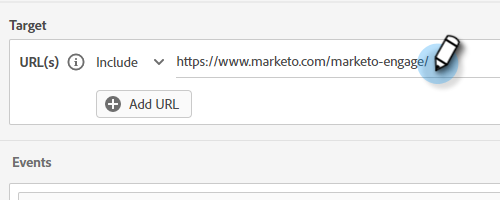

# 對象條件 {#audience-criteria}

對象條件屬性與Marketo Engage智慧清單類似，可讓您定義目標對象。 您可以使用推斷的、人員或公司屬性（或兩者的組合）來鎖定已知或未知的人員。

## 優先順序 {#priority}

優先順序決定潛在客戶符合多個對話方塊資格時，會收到哪個對話方塊。 它是當您首次[建立您的對話方塊](/help/marketo/product-docs/demand-generation/dynamic-chat/automated-chat/create-a-dialogue.md){target="_blank"}時建立的。 您可以開啟現有對話方塊並前往「對象條件」標籤中的&#x200B;**[!UICONTROL Dialogue Details]**，以變更其優先順序。

## 活動 {#events}

事件可讓您根據訪客的捲動次數或他們在您的頁面/網站上的時間長度來鎖定訪客。 在以下範例中，我們鎖定了在特定頁面上停留超過20秒的訪客。

1. 抓取&#x200B;**[!UICONTROL Time on Page]**&#x200B;事件並將其拖曳至右側。

   

1. 將&quot;[!UICONTROL Greater Than]&quot;時間設為20秒。

   

1. 在[[!UICONTROL Target]](#target)區段中新增所需頁面的URL。

   

## 屬性 {#attributes}

**已知人員**

有&#x200B;_多個_&#x200B;屬性組合可供選擇。 在以下範例中，我們鎖定加州所有在員工超過50人的公司中工作的已知人員。

1. 抓取&#x200B;**[!UICONTROL Person State]**&#x200B;屬性並將其拖曳到右邊。

   

1. _[!UICONTROL Is]_&#x200B;已預設設定。 在「選取值」欄位中輸入CA （您也可以按一下下拉式清單，然後從清單中選取）。

   

1. 抓取&#x200B;**[!UICONTROL Company Size]**&#x200B;屬性並將其拖曳到顯示&#x200B;_將屬性拖放到此處_&#x200B;的位置。

   

   >[!NOTE]
   >
   >您也可以按一下屬性的&#x200B;**+**&#x200B;圖示來選擇屬性。

1. 按一下運運算元下拉式清單，然後選取&#x200B;**[!UICONTROL Greater Than]**。

   

1. 輸入50，然後在熒幕上的其他位置按一下以儲存。

   

就是這樣！

**匿名人員**

有一個簡單的方法可以專門定位資料庫中尚未存取的人員。 在此範例中，我們鎖定位於紐約區域的所有匿名人員。

1. 抓取&#x200B;**[!UICONTROL Person Email]**&#x200B;屬性並將其拖曳到右邊。

   

1. 按一下運運算元下拉式清單，然後選取&#x200B;**[!UICONTROL Is Empty]**。

   

1. 抓取&#x200B;**[!UICONTROL Inferred State]**&#x200B;屬性並將其拖曳到顯示&#x200B;_將屬性拖放到此處_&#x200B;的位置。

   

   >[!NOTE]
   >
   >當有人造訪您的網站時，[Munchkin](/help/marketo/product-docs/administration/additional-integrations/add-munchkin-tracking-code-to-your-website.md){target="_blank"}會對其進行Cookie並將其放入系統中。 我們會在特殊的資料庫中查詢他們的IP，並推斷出各種好的資訊。

1. _[!UICONTROL Is]_&#x200B;已預設設定。 在「選取值」欄位中，輸入NY （您也可以按一下下拉式清單，然後從清單中選取）。

   

## 會籍 {#membership}

對對話方塊的目標對象使用Marketo Engage智慧清單。

>[!AVAILABILITY]
>
>智慧清單成員或清單成員條件需要Dynamic Chat Prime。 如需詳細資訊，請聯絡Adobe客戶團隊（您的客戶經理）。

1. 在成員資格下，抓取&#x200B;**[!UICONTROL Member of Smart List]**&#x200B;並將其放到畫布上。

   

1. 選取您需要的智慧清單。

   

## 新增群組 {#add-groups}

如果您想要擁有所有特定屬性以及其他「所有或任何」屬性，您也可以選擇群組屬性。 您可以新增多個群組。

## Target {#target}

這是您輸入要在其中顯示特定對話方塊的URL的位置。 您也可以選擇新增排除專案。

可接受的格式：

* `http://website.com`
* `https://*.website.com`
* `http://website.com/folder/*`
* `https://*.website.com/folder/*`

>[!NOTE]
>
>* 使用星號就像是一張全方位的萬用字元。 因此`https://*.website.com`會將對話方塊放在網站的每個頁面上，包括子網域（例如： `support.website.com`）。 而`https://website.com/folder/*`會將對話方塊放在後續資料夾的每個HTML頁面上(例如：在此案例中假設資料夾為&quot;sports&quot;，所以：website.com/sports/baseball.html、website.com/sports/football.html等)。
>
>* 目前不支援URL引數。

**排除專案**

使用排除專案來確保您的對話方塊&#x200B;_不會_&#x200B;出現在您網站的特定頁面/區域。 排除專案的格式與包含專案的格式相同。

>[!MORELIKETHIS]
>
>* [建立對話方塊](/help/marketo/product-docs/demand-generation/dynamic-chat/automated-chat/create-a-dialogue.md){target="_blank"}
>* [串流Designer](/help/marketo/product-docs/demand-generation/dynamic-chat/automated-chat/stream-designer.md){target="_blank"}
