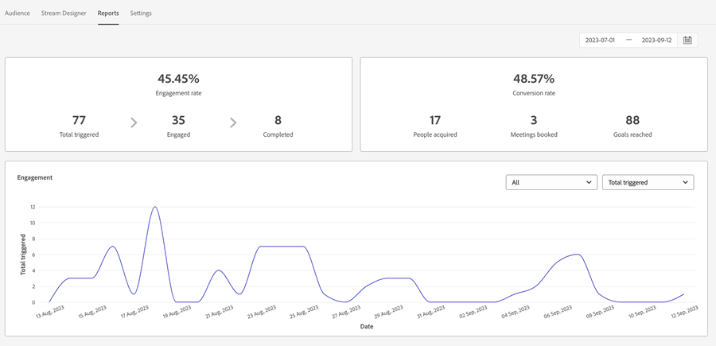

# 交談流程概觀 {#conversational-flow-overview}

設計對話流程，並根據特定動作(例如按一下call-to-action按鈕、頁面載入時、頁面逗留時間等)觸發給任何訪客。

## 對話與對話流程 {#dialogues-vs-conversational-flows}

雖然「對話方塊」和「對話流程」有幾個相似之處，但它們是兩個不同的功能。

<table>
 <tbody>
  <tr>
   <th style="width:50%">對話</th>
   <th style="width:50%">對話流程</th>
  </tr>
  <tr>
   <td>對話方塊是鎖定目標 — 您可以根據所實作的引數，為特定頁面和對象設計對話方塊。</td>
   <td>會觸發對話流程 — 您設計可根據訪客動作（如填寫表單、按一下連結等）觸發的對話。</td>
  </tr>
   <tr>
   <td>僅支援聊天機器人介面。</td>
   <td>目前可在快顯視窗介面中使用，並已規劃更多介面。</td>
  </tr>
  </tr>
   <tr>
   <td>可為同一潛在客戶區段建立多個對話方塊，並依照優先順序排列，以便每位訪客在持續參與時能依優先順序看見對話方塊。</td>
   <td>「對話流程」沒有優先順序，且根據call-to-action判定，可由相同潛在客戶觸發任何次數。</td>
  </tr>
  <tr>
   <td>聊天機器人對話由對話方塊提供。</td>
   <td><a href="/help/marketo/product-docs/demand-generation/dynamic-chat/automated-chat/conversational-flow-settings-for-marketo-engage-forms.md" target="_blank">Marketo Engage中的交談Forms</a>由交談流程提供支援。</td>
  </tr>
 </tbody>
</table>

## 串流Designer索引標籤 {#stream-designer-tab}

對話流程的串流Designer與對話的串流幾乎完全相同。 [在這裡瞭解所有資訊](/help/marketo/product-docs/demand-generation/dynamic-chat/automated-chat/stream-designer.md){target="_blank"}。

## 「報表」標籤 {#reports-tab}

在「報表」標籤中，您可以檢視對話流程的表現度量。

檢視參與率、轉換率、根據已知和/或未知訪客的篩選器等。

## 設定索引標籤 {#settings-tab}

在「設定」標籤的上半部，您可以更新「對話流程」的名稱、新增選擇性說明以及變更語言。

>[!NOTE]
>
>選取不同的語言只會變更系統文字的語言。 翻譯內容由您負責。

### 交談SDK {#conversations-sdk}

在「設定」標籤的下半部，自訂「交談」觸發程式(也稱為「交談」SDK)。 您可以決定在訪客點按任何連結或頁面載入時，您的網站上是否觸發交談。

>[!TIP]
>
>檢視[交談SDK](https://experienceleague.adobe.com/tools/marketo-dynamic-chatbot/conversations-sdk/){target="_blank"}正在執行中！

>[!MORELIKETHIS]
>
>[建立對話流程](/help/marketo/product-docs/demand-generation/dynamic-chat/automated-chat/create-a-conversational-flow.md){target="_blank"}
