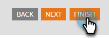

# Marketo Engage Forms的對話流量設定{#conversational-flow-settings-for-marketo-engage-forms}

將Marketo Engage Forms與Dynamic Chat Conversational Flows整合，使其可對話化。 使用表單資料或智慧清單成員資格來立即取得銷售機會資格，以符合預訂、白皮書連結或自訂目標。

>[!AVAILABILITY]
>
>智慧清單成員或清單成員條件需要Dynamic Chat Prime。 如需詳細資訊，請聯絡Adobe客戶團隊（您的客戶經理）。

1. 尋找並選取您的表單（或建立新表單）。

   

1. 按一下「**[!UICONTROL Edit Draft]**」。

   

1. 在表單編輯頁面上，按一下&#x200B;**[!UICONTROL Form Settings]**，然後按&#x200B;**[!UICONTROL Settings]**。

   

1. 按一下&#x200B;**[!UICONTROL Conversational Flow Settings]**&#x200B;滑桿以啟用。

   

1. 隨即顯示「預設選擇」強制回應視窗。 選取您的偏好設定。 在此範例中，我們選擇&#x200B;**[!UICONTROL Use Conversational Flow]**。

   

1. 選取所需的&#x200B;**[!UICONTROL Conversational Flow]**&#x200B;和&#x200B;**[!UICONTROL Delivery Type]**。

   

   >[!NOTE]
   >
   >[進一步瞭解對話流程](/help/marketo/product-docs/demand-generation/dynamic-chat/automated-chat/conversational-flow-overview.md){target="_blank"}

   **選擇性步驟**：您可以按一下「**[!UICONTROL Add Choice]**」，將符合特定條件的聊天訪客設為目標。 您最多可以新增九個選項，總共十個。

   

   >[!NOTE]
   >
   >在提交表單前，訪客的瀏覽器必須是以已知人員身分的Cookie，才能符合靜態/智慧清單成員資格。

   **選擇性步驟**：按一下每個步驟中的&#x200B;**+**&#x200B;符號以新增更多屬性，讓您縮小目標對象的範圍（可用的屬性是您為表單選擇的欄位）。 在此範例中，我們的目標是加州的Adobe技術撰稿人。

   

   >[!NOTE]
   >
   >條件邏輯設為「全部」表示必須符合每個屬性才能符合資格。 條件邏輯設為「任何」表示任一個屬性皆已足夠。

   **選擇性步驟**：如果您新增兩個或多個選項，可以按一下它們的上/下箭頭來重新排序。

   

1. 完成時，按一下&#x200B;**[!UICONTROL Finish]**。

   
