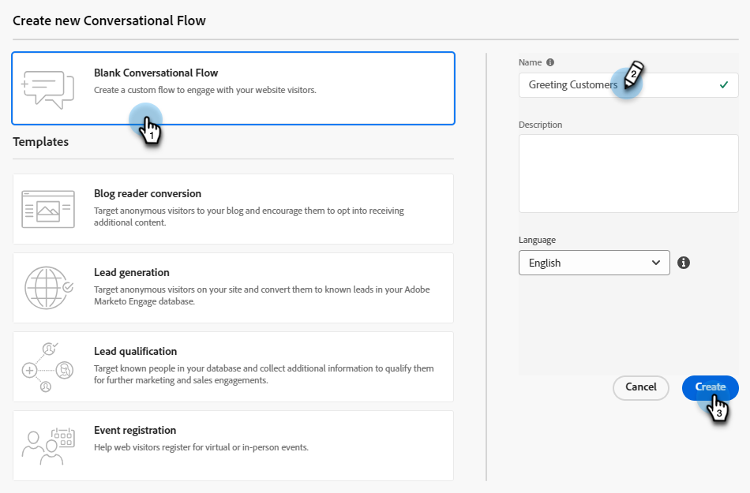

# 建立對話流程 {#create-a-conversational-flow}

以下說明如何建立新的對話流程。

1. 在「自動聊天」底下，按一下 **對話流程**.

   

1. 按一下 **建立對話流程**.

   

1. 選擇空白的「對話流程」或其中一個預先填入的範本。 輸入名稱（說明為選用）、變更語言（選用），然後按一下 **建立**.

   

   >[!NOTE]
   >
   >這只會變更系統文字的語言。 翻譯內容由您負責。

1. 就像對話方塊中的一樣，此時此刻， [建立串流](/help/marketo/product-docs/demand-generation/dynamic-chat/automated-chat/stream-designer.md#create-a-stream){target="_blank"}.

>[!MORELIKETHIS]
>
>[對話流程概觀](/help/marketo/product-docs/demand-generation/dynamic-chat/automated-chat/conversational-flow-overview.md){target="_blank"}
