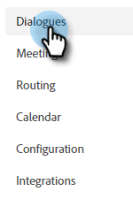

# 建立對話 {#create-a-dialogue}

以下說明如何建立新的對話方塊。

1. 按一下「**[!UICONTROL Dialogues]**」。

   

1. 按一下&#x200B;**[!UICONTROL Create New]**&#x200B;按鈕。

   

1. 選擇空白對話方塊，或其中一個預先填入的範本。 輸入名稱（說明為選用）、變更優先順序層級（選用），然後按一下&#x200B;**[!UICONTROL Create]**。

   

>[!NOTE]
>
>優先順序決定當訪客符合約時使用多個對話方塊的資格時，要向訪客顯示的對話方塊。

接下來，瞭解如何[建立資料流](/help/marketo/product-docs/demand-generation/dynamic-chat/automated-chat/stream-designer.md#create-a-stream){target="_blank"}。

>[!MORELIKETHIS]
>
>* [對象條件](/help/marketo/product-docs/demand-generation/dynamic-chat/automated-chat/audience-criteria.md){target="_blank"}
>* [串流Designer](/help/marketo/product-docs/demand-generation/dynamic-chat/automated-chat/stream-designer.md){target="_blank"}
