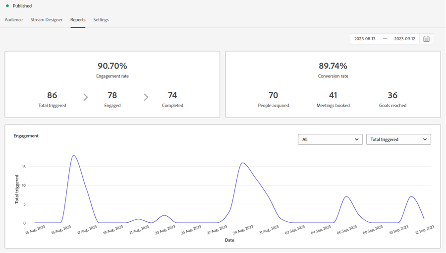

# 對話方塊概述 {#dialogue-overview}

對話方塊是個別的聊天對話方塊。 在每個對話方塊中，您會決定顯示特定聊天對話的位置、顯示對象以及對話的內容。 每個對話方塊都有自己的報告頁面，您可以在其中監控成效。

## 對象條件 {#audience-criteria}

對話方塊的[對象條件](/help/marketo/product-docs/demand-generation/dynamic-chat/automated-chat/audience-criteria.md){target="_blank"}區段是您定義聊天對話顯示位置及對象的位置

## 流程設計工具 {#stream-designer}

對話方塊的[串流Designer](/help/marketo/product-docs/demand-generation/dynamic-chat/automated-chat/stream-designer.md){target="_blank"}區段是您設計要與網站訪客進行對話的位置。

## 報表 {#reports}

在「報表」索引標籤中，您可以檢視有關對話方塊執行狀況的量度。

<table>
 <tr>
  <td><strong>總計已觸發</strong></td>
  <td>每次在訪客符合資格/顯示對話方塊時遞增。
</td>
 </tr>
 <tr>
  <td><strong>已參與</strong></td>
  <td>當訪客與對話方塊中的至少一個卡片互動（例如，問題、資訊擷取等）時增加</td>
 </tr>
 <tr>
  <td><strong>已完成</strong></td>
  <td>每當訪客到達對話方塊中任何分支的結尾時，遞增。</td>
 </tr>
 <tr>
  <td><strong>已獲取的人員</strong></td>
  <td>每次訪客在對話方塊流程中提供有效的電子郵件地址時遞增。</td>
 </tr>
 <tr>
  <td><strong>已預訂的會議</strong></td>
  <td>每次訪客透過聊天機器人成功排程約會時遞增。</td>
 </tr>
 <tr>
  <td><strong>已達到的目標</strong></td>
  <td>訪客在任何對話方塊流程中達到目標時遞增。</td>
 </tr>
</table>

## 停用/啟用所有對話方塊 {#disable-enable-all-dialogues}

您可以同時停用（及重新啟用）所有已發佈的對話方塊。

1. 在Dynamic Chat中，按一下「**[!UICONTROL Configuration]**」標籤。

   

1. 將&#x200B;**[!UICONTROL Chat Enabled]**&#x200B;開關切換為關閉以停用（再切換為開啟以重新啟用）所有對話方塊。

   
