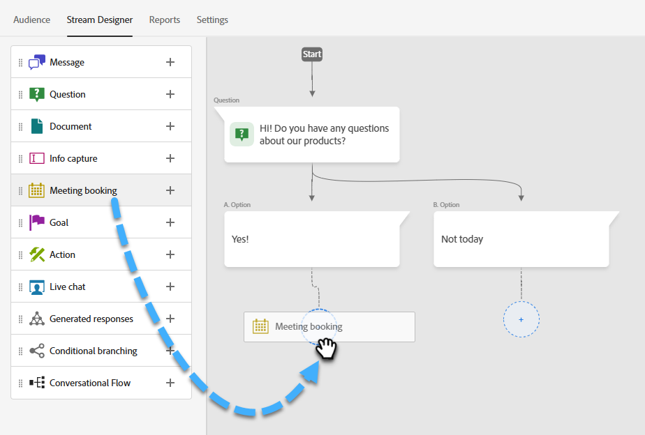
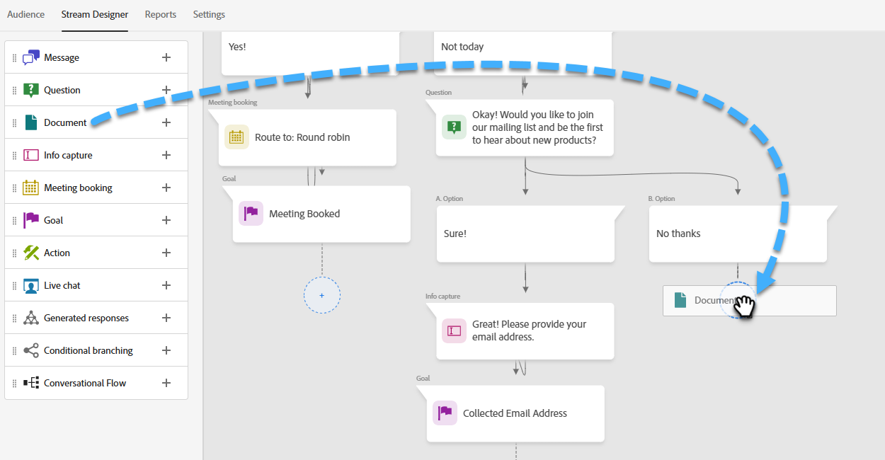

# 流程設計工具 {#stream-designer}

可能有&#x200B;_多個_&#x200B;資料流組合。 本文包含行銷人員詢問網站訪客是否有任何產品問題的範例。 如果是，訪客可以排程約會。 如果沒有，訪客可以選擇加入郵寄清單以備將來通訊。 此外還提供免費PDF。 最終目標是排程約會或收集訪客的電子郵件。

>[!PREREQUISITES]
>
>您必須先在您的Adobe帳戶中[設定](/help/marketo/product-docs/demand-generation/dynamic-chat/integrations/adobe-pdf-embed-api.md){target="_blank"}，才能使用檔案卡。

## 串流Designer卡 {#stream-designer-cards}

串流Designer包含多張卡片，您可以新增卡片來塑造聊天對話。

<table>
 <tr>
  <td style="width:25%"><strong>訊息</strong></td>
  <td>當您想發表不需回應的陳述式時使用(例如：「嗨！ 所有商品今天皆有25%優惠（優惠碼SAVE25"）。
</td>
 </tr>
 <tr>
  <td style="width:25%"><strong>問題</strong></td>
  <td>當您想要詢問多重選擇問題時，請使用該選項，您可以提供其中可用的回應（例如：您感興趣的車輛型別為何？） 回應= SUV、Compact、Truck等)。</td>
 </tr>
 <tr>
  <td style="width:25%"><strong>文件</strong></td>
  <td>可讓您將PDF檔案內嵌在對話方塊中，並追蹤訪客的檔案參與活動（已檢視多少頁面、是否已下載檔案，及/或任何使用的搜尋詞）。</td>
 </tr>
 <tr>
  <td style="width:25%"><strong>資訊擷取</strong></td>
  <td>當您想要收集資訊（例如姓名、電子郵件地址、職稱等）時使用。 選擇要將訪客的回應歸因到哪個欄位後，您可以選擇讓訪客輸入回應，或從您決定的挑選清單中選取選項（秘訣：後者可協助改善資料庫清潔度）。 您也可以選擇以他們的回應覆寫您目前為其列出的任何資料，或者，如果您已經擁有問題的值，則完全略過問題。</td>
 </tr>
 <tr>
  <td style="width:25%"><strong>會議預訂</strong></td>
  <td>為訪客提供可用日期的行事曆以排程會議。 透過循環配置資源、特定代理程式或使用自訂規則，選擇行事曆可用性。 如果您想要擷取代理程式的名稱或電子郵件地址，並將它指派給聊天訪客的個人記錄以供日後查詢，請按一下<b>新增屬性</b> (提示：建立<a href="/help/marketo/product-docs/administration/field-management/create-a-custom-field-in-marketo.md" target="_blank">自訂欄位</a>以將代理程式的資訊對應到以不覆寫標準Marketo Engage欄位)。</td>
 </tr>
 <tr>
  <td style="width:25%"><strong>目標</strong></td>
  <td>這是訪客唯一不會看到的卡片。 您可以決定在特定聊天中達成目標的時間（例如：如果收集訪客的電子郵件是您的目標，請在資料流中的資訊擷取之後立即放置目標卡片）。</td>
 </tr>
 <tr>
  <td style="width:25%"><strong>動作*</strong></td>
  <td>類似於表單中的隱藏欄位，您可以使用動作卡將您要擷取潛在客戶記錄的隱含值填入任何潛在客戶或公司屬性（具有<a href="/help/marketo/product-docs/administration/field-management/custom-field-type-glossary.md#string">字串資料型別</a>）。 您可以在交談的任何時間點新增動作卡，並使用自動填入個別值的值或原生權杖更新個別屬性。
  
<i>*動作卡需要Dynamic Chat Prime。 如需詳細資訊，請聯絡Adobe客戶團隊（您的客戶經理）。</i></td>
 </tr>
 <tr>
  <td style="width:25%"><strong>即時聊天</strong></td>
  <td>當您希望訪客與即時代理程式聊天時，請使用即時聊天卡。
  <li>即時聊天卡必須是分支中的最後一張卡。</li>
  <li>訪客在資料流中到達這張卡片後，就會立即路由到代理商，因此建議在此卡片前面加上問答卡，詢問訪客是否想與即時代理商聊天。</li></td>
 </tr>
</table>

## 串流Designer圖示 {#stream-designer-icons}

在Stream Designer的右上角，您會看到幾個圖示。 以下是他們的工作。

<table>
 <tr>
  <td style="width:10%"></td>
  <td>放大，建立更大的卡片</td>
 </tr>
 <tr>
  <td style="width:10%"></td>
  <td>縮小，建立較小的卡片</td>
 </tr>
 <tr>
  <td style="width:10%"></td>
  <td>開啟一個視窗，供您測試您的聊天（按相同按鈕關閉）</td>
 </tr>
 <tr>
  <td style="width:10%"></td>
  <td>可讓您搜尋資料流中的卡片型別或內容</td>
 </tr>
 <tr>
  <td style="width:10%"></td>
  <td>排列串流中的所有卡片</td>
 </tr>
</table>

## 建立資料流 {#create-a-stream}

您可以建立對話方塊或[對話式Forms](/help/marketo/product-docs/demand-generation/dynamic-chat/automated-chat/conversational-flow-overview.md){target="_blank"}的串流。 在此範例中，我們將為對話方塊建立一個對話方塊。

1. 在您[建立對話方塊](/help/marketo/product-docs/demand-generation/dynamic-chat/automated-chat/create-a-dialogue.md){target="_blank"}之後，請按一下&#x200B;**[!UICONTROL 串流Designer]**&#x200B;索引標籤。

   

1. 拖放[!UICONTROL 問題]卡片。

   

1. 在[!UICONTROL 聊天機器人回應]底下，說出您想要如何回答的問題。

   

   >[!TIP]
   >
   >您可以使用代號（例如： Hello `{{lead.leadFirstName:""}}`）為已知的聊天訪客個人化體驗。 只要按一下右側的花括弧圖示，即可進行選取。 如果您希望匿名訪客看到一般專案（例如： Hello `{{lead.leadFirstName:"there"}}`），請在引號之間新增預設值。

   >[!NOTE]
   >
   >Poke預設為開啟，這會在聊天圖示旁邊顯示開頭的問題，訪客不需要按一下它即可檢視。 Poke只適用於交談中的第一張卡片。

1. 輸入您的使用者回應，然後按一下&#x200B;**[!UICONTROL 儲存]**。

   

   >[!NOTE]
   >
   >**[!UICONTROL 編輯儲存的值]**&#x200B;是選擇性的步驟，適用於想要將不同的值儲存在資料庫中（例如訪客看到「搜尋引擎最佳化」，而您將該值儲存為「SEO」），而不是儲存在聊天機器人中，針對問題卡中對應屬性的訪客顯示的值。

1. 若為「是」，我們想要排程約會，因此在該選項下方將拖曳到「約會排程器」卡上。

   

1. 在右邊的欄中，按一下&#x200B;**[!UICONTROL 儲存]**。

   

1. 由於這是目標，請將[!UICONTROL 目標]卡片拖曳到約會排程器下方。

   

1. 命名您的目標（或選擇現有的目標），然後按一下[儲存]。****

   

1. 若為「否」，我們想要檢視他們是否會加入郵寄清單，所以在該選項下方將拖曳到另一個[!UICONTROL 問題]卡片。

   

1. 輸入您的回應，並為訪客新增回應選擇。 完成時，按一下&#x200B;**[!UICONTROL 儲存]**。

   

   >[!NOTE]
   >
   >您可以按一下&#x200B;**[!UICONTROL 新增回應]**，以新增更多回應。

1. 在「是」回應下方，拖曳至「資訊擷取」卡片上方，以便收集訪客的電子郵件。

   

1. 按一下&#x200B;**[!UICONTROL 型別]**&#x200B;下拉式清單，然後選取&#x200B;**[!UICONTROL 電子郵件]**。

   

1. 輸入聊天機器人訊息和預留位置。 確定屬性已對應到Marketo Engage中的適當欄位，然後按一下[儲存]。****

   

   <table>
    <tr>
     <td style="width:30%"><strong>類型</strong></td>
     <td>您要擷取的資訊型別：電話、文字、電子郵件。</td>
    </tr>
    <tr>
     <td style="width:30%"><strong>聊天機器人訊息</strong></td>
     <td>訪客看到的訊息，提示他們提供資訊。</td>
    </tr>
    <tr>
     <td style="width:30%"><strong>預留位置</strong></td>
     <td>範例文字可協助訪客檢視要輸入的內容。</td>
    </tr>
    <tr>
     <td style="width:30%"><strong>將回應對應到屬性</strong></td>
     <td>可讓您將訪客的回應同步至您Marketo Engage訂閱中其「人員」記錄中的對應欄位。</td>
    </tr>
   </table>

1. 由於收集他們的電子郵件是目標，請將[!UICONTROL 目標]卡片拖曳至「資訊擷取」下方。

   

1. 命名您的目標（或選擇現有的目標），然後按一下[儲存]。****

   

1. 如果對方說「否」，請記得新增回應。 一個選項是拖曳下方的訊息卡，並說「仍要感謝您」。 但在此範例中，我們會改為提供他們自由PDF檔案。

   

1. 在此範例中，我們將建立新檔案。 請為它命名，輸入您已託管之PDF的URL，然後按一下&#x200B;**[!UICONTROL 儲存]**。

   

1. 選取&#x200B;**[!UICONTROL 預覽]**&#x200B;切換以預覽您的對話方塊。

   

1. 當您準備好要啟動對話方塊時，請按一下&#x200B;**[!UICONTROL Publish]**。

   

>[!NOTE]
>
>按一下[!UICONTROL Publish]之前，請記得確定您已[輸入目標URL](/help/marketo/product-docs/demand-generation/dynamic-chat/automated-chat/audience-criteria.md#target){target="_blank"}。

>[!MORELIKETHIS]
>
>* [建立對話方塊](/help/marketo/product-docs/demand-generation/dynamic-chat/automated-chat/create-a-dialogue.md){target="_blank"}
>* [對象條件](/help/marketo/product-docs/demand-generation/dynamic-chat/automated-chat/audience-criteria.md){target="_blank"}
>* [Adobe PDF內嵌API](/help/marketo/product-docs/demand-generation/dynamic-chat/integrations/adobe-pdf-embed-api.md){target="_blank"}
