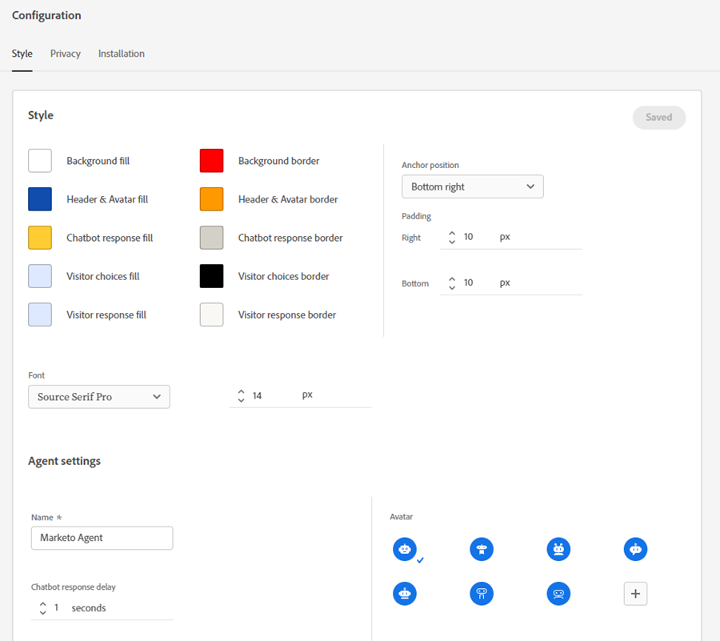

# 設定 {#configuration}

了解如何自訂聊天機器人對話方塊視窗的外觀與風格。

若要開始使用，請按一下&#x200B;**Configuration**。

有數種不同的自訂選項。

## 樣式標籤 {#style-tab}

**樣式**

您將在此處定義將顯示對話方塊的聊天機器人的外觀和風格，包括：顏色、字型、機器人介面工具集的放置，以及聊天機器人的名稱/頭像。

每個類別的顏色由[十六進位顏色值](https://color.adobe.com/create/color-wheel)(例如，白色= #ffffff、紅色= #bf1932等)決定。

錨點可讓您的網站訪客開啟/關閉動話方塊。 您可以選擇要讓該圖示顯示在右下方還是左下方。 您也可以增加/減少填補（圖示與網頁底部之間的空間量）。

**代理設定**

在「代理設定」中，您可以將標籤新增至您的動話方塊(例如：「Adobe機器人」)，會顯示在頂端。 您也可以判斷回應延遲（以秒為單位），並變更您的聊天頭像。

完成更改後，請記得按一下&#x200B;**Save**。

## 隱私權標籤 {#privacy-tab}

按一下&#x200B;**Privacy**&#x200B;標籤以新增/編輯您網站的隱私權原則的URL（選用）。

## 「安裝」頁簽 {#installation-tab}

若要讓聊天機器人顯示在您的網站上，您必須先安裝動態聊天JavaScript程式碼片段。 按一下此標籤可尋找/複製必要的程式碼。 如果您不熟悉此操作，請聯繫您的Web團隊或IT部門尋求幫助。

>[!NOTE]
>
>Marketo支援未設定來協助疑難排解HTML。 如需HTML協助，請洽詢網頁開發人員。
