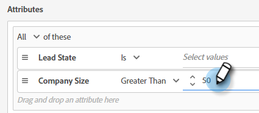

# 對話方塊 {#dialogues}

對話是個別的聊天對話。 了解如何以視覺化方式自訂頁面、決定其上顯示的頁面，以及決定說明的內容以及看見者。

## 建立新對話方塊 {#create-a-new-dialogue}

1. 按一下&#x200B;**對話框**。

   

1. 按一下&#x200B;**新建**&#x200B;按鈕。

   

1. 輸入名稱（說明為可選），設定優先順序級別，然後按一下&#x200B;**Save**。

   

>[!NOTE]
>
>優先順序決定當訪客同時符合多個對話方塊的資格時，將向訪客顯示哪個對話方塊。

## 對象條件 {#audience-criteria}

與Marketo智慧清單類似，受眾條件屬性可讓您定義目標受眾。 您可以使用推斷、人員或公司屬性（或其組合）來鎖定已知或未知的人。

**已知人員**

有許多&#x200B;_屬性組合可供選擇。_&#x200B;在此範例中，我們鎖定加州所有在員工超過50名的公司工作的&#x200B;**已知人員**。

1. 抓取&#x200B;**人員狀態**&#x200B;屬性並將其拖曳至右側。

   

1. __ 預設設定ISIS。在「選擇值」欄位中，鍵入CA（您也可以按一下下拉式清單並從清單中選擇）。

   

1. 抓取&#x200B;**公司大小**&#x200B;屬性，並將其拖曳至顯示&#x200B;_的位置，將屬性拖曳至此處_。

   

   >[!NOTE]
   >
   >您也可以按一下屬性的&#x200B;**+**&#x200B;圖示來選擇屬性。

1. 按一下運算子下拉式清單，然後選取&#x200B;**大於**。

   

1. 輸入50，然後按一下畫面上的其他位置以儲存。

   

就這樣！

**匿名人員**

有一種簡單的方法可以專門定位尚未在資料庫中的人員。 在此範例中，我們鎖定位於紐約地區的所有&#x200B;**匿名人員**。

1. 抓取&#x200B;**人員電子郵件**&#x200B;屬性並將其拖曳至右側。

   

1. 按一下運算子下拉式清單，然後選取&#x200B;**Is Empty**。

   

1. 抓取&#x200B;**推斷狀態**&#x200B;屬性，並將其拖曳至顯示&#x200B;_的位置，將屬性拖曳至此處_。

   

   >[!NOTE]
   >
   >當有人造訪您的網站時，[Munchkin](/help/marketo/product-docs/administration/additional-integrations/add-munchkin-tracking-code-to-your-website.md)會將其加入系統。 我們在一個特殊的資料庫中查找他們的IP，並推斷出各種好的資訊。

1. __ 預設設定ISIS。在「選取值」欄位中，輸入NY（您也可以按一下下拉式清單，然後從清單中選取）。

   

## 新增群組 {#add-groups}

您也可以選擇將屬性分組，以備您想擁有所有特定屬性以及其他屬性的「全部或任何」時使用。 您可以新增多個群組。

## 目標 {#target}

在此處輸入要顯示特定對話方塊的URL。

可接受的格式：

* `http://website.com`
* `https://*.website.com`
* `http://website.com/folder/*`
* `https://*.website.com/folder/*`

>[!NOTE]
>
>使用星號可當作全包王牌。 因此， `https://*.website.com`會將對話方塊放在網站的每個頁面上，包括子網域(例如：`support.website.com`)。 而`https://website.com/folder/*`會將對話方塊放在後續資料夾中每個HTML頁面上(例如：在此案例中，假設資料夾為「sports」，因此：website.com/sports/baseball.html、website.com/sports/football.html等)。

## 串流設計工具 {#stream-designer}

流設計器包含可添加的不同資訊卡，以形成聊天對話。

<table>
 <tr>
  <td><strong>訊息</strong></td>
  <td>當您想要做陳述而不需要回應時使用(例如：「嗨！ 使用代碼SAVE25」時，所有項目今天可節省25%。
</td>
 </tr>
 <tr>
  <td><strong>問題</strong></td>
  <td>當您想要詢問多選題時使用，您會提供可用的回應(例如：你對哪種車感興趣？ 回應= SUV、小型車、卡車等)。</td>
 </tr>
 <tr>
  <td><strong>資訊捕獲</strong></td>
  <td>收集資訊時使用。 要選擇的三個欄位是「電子郵件地址」、「電話號碼」和「文字」（這可讓訪客自行撰寫訊息）。</td>
 </tr>
 <tr>
  <td><strong>約會排程器</strong></td>
  <td>為訪客提供可用日期的日曆，以排程後續作業。 日曆可用性反映了<a href="/help/marketo/product-docs/demand-generation/dynamic-chat/dynamic-chat-overview.md#routing">行</a>中的下一個代理。</td>
 </tr>
 <tr>
  <td><strong>目標</strong></td>
  <td>這是訪客唯一看不到的卡片。 您可以決定在哪個時間點在特定聊天內達成目標(例如：如果收集訪客的電子郵件是您的目標，請將「目標」卡片緊接在資料流中的「資訊擷取」之後)。</td>
 </tr>
</table>

**建立資料流**

可能有&#x200B;_許多_&#x200B;可能的資料流組合。 讓我們看看本文](/help/marketo/product-docs/demand-generation/dynamic-chat/create-a-stream.md)中的一個範例[。

## 報表 {#reports}

在「報表」標籤中，檢視過去90天的資料。 每個類別的定義如下。

<table>
 <tr>
  <td><strong>觸發總計</strong></td>
  <td>每次訪客符合/顯示對話方塊時增加。
</td>
 </tr>
 <tr>
  <td><strong>參與</strong></td>
  <td>每次訪客點按動作機器人錨點以開啟對話方塊時增量。</td>
 </tr>
 <tr>
  <td><strong>已完成</strong></td>
  <td>每次訪客到達對話方塊中任何分支的結尾時增加。</td>
 </tr>
 <tr>
  <td><strong>被俘人員</strong></td>
  <td>每次訪客在對話方塊流程中提供有效電子郵件地址時增加。</td>
 </tr>
 <tr>
  <td><strong>已預訂的會議</strong></td>
  <td>每次訪客透過動作機器人成功排程約會時增加。</td>
 </tr>
 <tr>
  <td><strong>已達目標</strong></td>
  <td>在任何對話方塊流程中，每當訪客達到目標時增加。</td>
 </tr>
</table>

>[!MORELIKETHIS]
>
>[建立資料流](/help/marketo/product-docs/demand-generation/dynamic-chat/create-a-stream.md)
