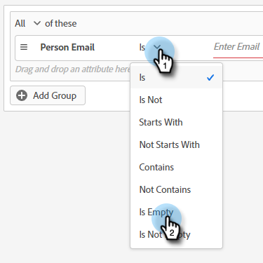
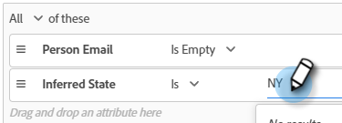

# 對象條件 {#audience-criteria}

對象條件屬性與Marketo智慧清單類似，可讓您定義目標對象。 您可以使用推斷的、人員或公司屬性（或兩者的組合）來鎖定已知或未知的人員。

## 優先順序 {#priority}

優先順序決定潛在客戶符合多個對話方塊資格時，會收到哪個對話方塊。 它是當您第一次使用 [建立您的對話方塊](/help/marketo/product-docs/demand-generation/dynamic-chat/dialogues/create-a-dialogue.md){target="_blank"}. 您可以開啟現有對話方塊並前往 **對話方塊詳細資料** 在「對象條件」標籤中。

## 事件 {#events}

事件可讓您根據訪客的捲動次數或他們在您的頁面/網站上的時間長度來鎖定訪客。 在以下範例中，我們鎖定了在特定頁面上停留超過20秒的訪客。

1. 抓取 **頁面逗留時間** 事件，並將其拖曳至右側。

   

1. 將「大於」時間設為20秒。

   

1. 在中新增所需頁面的URL [Target](#target) 區段。

   

## 屬性 {#attributes}

**已知人員**

有 _許多_ 屬性組合以供選擇。 在以下範例中，我們鎖定所有 **已知人員** 在員工超過50人的公司工作的員工。

1. 抓取 **個人狀態** 屬性，並將其拖曳到右邊。

   

1. _是_ 已預設設定。 在「選取值」欄位中輸入CA （您也可以按一下下拉式清單，然後從清單中選取）。

   

1. 抓取 **公司規模** 屬性，並將其拖曳到上面寫著 _將屬性拖放到這裡_.

   

   >[!NOTE]
   >
   >您也可以按一下屬性 **+** 圖示。

1. 按一下運運算元下拉式清單，然後選取 **大於**.

   

1. 輸入50，然後在熒幕上的其他位置按一下以儲存。

   

就是這樣！

**匿名人員**

有一個簡單的方法可以專門定位資料庫中尚未存取的人員。 在此範例中，我們鎖定所有 **匿名人員** 位於紐約地區。

1. 抓取 **個人電子郵件** 屬性，並將其拖曳到右邊。

   

1. 按一下運運算元下拉式清單，然後選取 **為空**.

   

1. 抓取 **推斷的狀態** 屬性，並將其拖曳到上面寫著 _將屬性拖放到這裡_.

   

   >[!NOTE]
   >
   >有人造訪您的網站時， [Munchkin](/help/marketo/product-docs/administration/additional-integrations/add-munchkin-tracking-code-to-your-website.md) 對使用者進行Cookie，並將他們放入系統中。 我們會在特殊的資料庫中查詢他們的IP，並推斷出各種好的資訊。

1. _是_ 已預設設定。 在「選取值」欄位中，輸入NY （您也可以按一下下拉式清單，然後從清單中選取）。

   

## 新增群組 {#add-groups}

如果您想要擁有所有特定屬性以及其他「所有或任何」屬性，您也可以選擇群組屬性。 您可以新增多個群組。

## 目標 {#target}

這是您輸入要在其中顯示特定對話方塊的URL的位置。 您也可以選擇新增排除專案。

可接受的格式：

* `http://website.com`
* `https://*.website.com`
* `http://website.com/folder/*`
* `https://*.website.com/folder/*`

>[!NOTE]
>
>使用星號就像是一張全方位的萬用字元。 所以 `https://*.website.com` 會將對話方塊放置在網站的每個頁面上，包括子網域(例如： `support.website.com`)。 與 `https://website.com/folder/*` 會在後續資料夾的每個HTML頁面上放置對話方塊(例如：在此案例中，假設資料夾為&quot;sports&quot;，所以：website.com/sports/baseball.html、website.com/sports/football.html等)。

**排除**

使用排除專案來確保您的對話方塊可以 **非** 會出現在您網站的特定頁面/區域中。 排除專案的格式與包含專案的格式相同。

>[!MORELIKETHIS]
>
>* [建立對話方塊](/help/marketo/product-docs/demand-generation/dynamic-chat/dialogues/create-a-dialogue.md){target="_blank"}
>* [流程設計工具](/help/marketo/product-docs/demand-generation/dynamic-chat/dialogues/stream-designer.md){target="_blank"}
>* [報表](/help/marketo/product-docs/demand-generation/dynamic-chat/dialogues/reports.md){target="_blank"}
