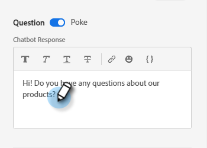
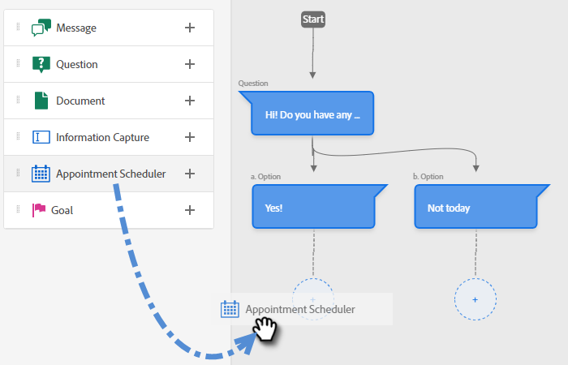

# 流程設計工具 {#stream-designer}

有 _許多_ 流組合是可能的。 本文包含一個示例，在該示例中，商家詢問站點訪問者是否有任何產品問題。 如果是，訪問者可以安排預約。 如果否，則允許訪問者加入郵件清單以供將來通信。 酒店還提供免費PDF。 最終目標是安排預約或收集訪問者的電子郵件。

>[!PREREQUISITES]
>
>在使用文檔卡之前，必須先 [設定](/help/marketo/product-docs/demand-generation/dynamic-chat/integrations/using-the-document-card.md){target=&quot;_blank&quot;}。

## 流設計卡 {#stream-designer-cards}

流設計器包含多個可添加以塑造聊天對話形狀的卡。

<table>
 <tr>
  <td><strong>訊息</strong></td>
  <td>在您想要生成無需響應的語句時使用(例如：「嗨！ 所有項目今天都減少了25%，代碼為SAVE25")。
</td>
 </tr>
 <tr>
  <td><strong>問題</strong></td>
  <td>當您想問多選題時使用，您將提供其可用回答(例如：你對哪種車感興趣？ 響應= SUV、緊湊型、卡車等)。</td>
 </tr>
 <tr>
  <td><strong>文件</strong></td>
  <td>允許您將PDF文檔嵌入對話框並跟蹤訪問者的文檔參與活動（如果已下載文檔，則查看了多少頁，和/或使用的任何搜索詞）。</td>
 </tr>
 <tr>
  <td><strong>資訊擷取</strong></td>
  <td>在要收集資訊時使用。 要選擇的三個欄位是「電子郵件地址」、「電話號碼」和「文本」（允許訪問者自行寫郵件）。</td>
 </tr>
 <tr>
  <td><strong>約會排程器</strong></td>
  <td>為訪問者提供可用日期日曆，以安排後續活動。 日曆可用性反映 <a href="/help/marketo/product-docs/demand-generation/dynamic-chat/dynamic-chat-overview.md#routing">下一個聯機代理</a>。</td>
 </tr>
 <tr>
  <td><strong>目標</strong></td>
  <td>這是訪客看不到的唯一一張牌。 您需要確定在特定聊天中的哪個點實現目標(例如：如果收集訪問者的電子郵件是您的目標，請將目標卡立即放在流中「資訊捕獲」之後)。</td>
 </tr>
</table>

## 建立流 {#create-a-stream}

1. 等你 [已建立對話框](/help/marketo/product-docs/demand-generation/dynamic-chat/dialogues/create-a-dialogue.md){target=&quot;_blank&quot;}，按一下 **流設計器** 頁籤。

   

1. 拖放問題卡。

   

1. 在查博回應下，你想問什麼。

   

   >[!NOTE]
   >
   >預設情況下，Poke設定為on ，即在聊天表徵圖旁顯示開題，而訪問者不必按一下它即可查看。 Poke僅在對話中的第一張卡上可用。

1. 輸入用戶響應，然後按一下 **保存**。

   

   >[!NOTE]
   >
   >**編輯儲存的值** 對於希望在資料庫中儲存與查看機中訪問者在查看卡中映射屬性時所顯示的值不同的用戶，這是可選步驟(例如：訪問者看到「搜索引擎優化」，將該值儲存為「SEO」。)

1. 對於「是」，我們要安排約會，因此在該選項下方拖動到約會計畫程式卡上。

   

1. 在右側的列中，按一下 **保存**。

   

1. 因為這是目標，請將目標卡拖到約會計畫程式下面。

   

1. 命名目標（或選擇現有目標），然後按一下 **保存**。

   

1. 對於「否」，我們希望查看他們是否會加入郵件清單，因此，在該選項下面，將其拖動到另一問號卡上。

   

1. 輸入您的響應，並為訪問者添加響應選項。 按一下 **保存** 完成。

   

   >[!NOTE]
   >
   >您可以通過按一下 **添加響應**。

1. 在「Yes（是）」響應下，拖動「Info Capture（資訊捕獲）」卡，以便收集訪問者的電子郵件。

   

1. 按一下 **類型** 下拉並選擇 **電子郵件**。

   

1. 輸入聊天器消息和佔位符。 確保屬性映射到Marketo的相應欄位，然後按一下 **保存**。

   

   <table>
    <tr>
     <td><strong>類型</strong></td>
     <td>要捕獲的資訊類型：電話，簡訊，電子郵件。</td>
    </tr>
    <tr>
     <td><strong>聊天機器人訊息</strong></td>
     <td>訪問者看到的消息提示他們提供資訊。</td>
    </tr>
    <tr>
     <td><strong>預留位置</strong></td>
     <td>幫助訪問者查看要輸入的內容的示例文本。</td>
    </tr>
    <tr>
     <td><strong>將回應對應到屬性</strong></td>
     <td>允許您將訪問者的響應同步到您的Marketo訂閱中其人員記錄中的相應欄位。</td>
    </tr>
   </table>

1. 由於收集其電子郵件是一個目標，請將目標卡拖到「資訊捕獲」下。

   

1. 命名目標（或選擇現有目標），然後按一下 **保存**。

   

1. 如果他們說「否」，請記住添加一個響應。 一個選項是將留言卡拖到下面，然後說「反正謝謝」。 但在本例中，我們將為他們提供一個免費PDF文檔。

   

1. 在此示例中，我們將建立新文檔。 給它一個名稱，輸入您已托管的PDF的URL，然後按一下 **保存**。

   

1. 選擇 **預覽** 切換以預覽對話框。

   

1. 準備好激活對話框後，按一下 **發佈**。

   

>[!NOTE]
>
>在按一下「發佈」之前，請記住確保 [已輸入目標URL](/help/marketo/product-docs/demand-generation/dynamic-chat/dialogues/audience-criteria.md#target){target=&quot;_blank&quot;}。

>[!MORELIKETHIS]
>
>* [建立對話框](/help/marketo/product-docs/demand-generation/dynamic-chat/dialogues/create-a-dialogue.md){target=&quot;_blank&quot;
>* [受眾標準](/help/marketo/product-docs/demand-generation/dynamic-chat/dialogues/audience-criteria.md){target=&quot;_blank&quot;
>* [報告](/help/marketo/product-docs/demand-generation/dynamic-chat/dialogues/reports.md){target=&quot;_blank&quot;
>* [使用文檔卡](/help/marketo/product-docs/demand-generation/dynamic-chat/integrations/using-the-document-card.md){target=&quot;_blank&quot;

