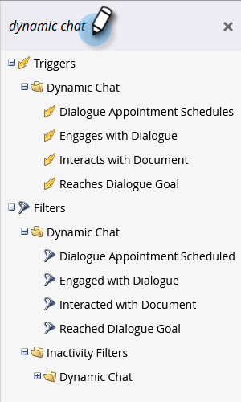

# 動態聊天活動 {#dynamic-chat-activities}

Dynamic Chat提供數個篩選器和觸發器，用於您的智慧清單。

## 注意事項 {#things-to-note}

* Dynamic Chat流程步驟支援條件
* Dynamic Chat活動可以同步至 [Marketo Sales Insight](/help/marketo/product-docs/marketo-sales-insight/msi-for-salesforce/features/dynamic-chat-integration.md){target="_blank"}
* 您可以在個人記錄的活動記錄中檢視個別Dynamic Chat活動
