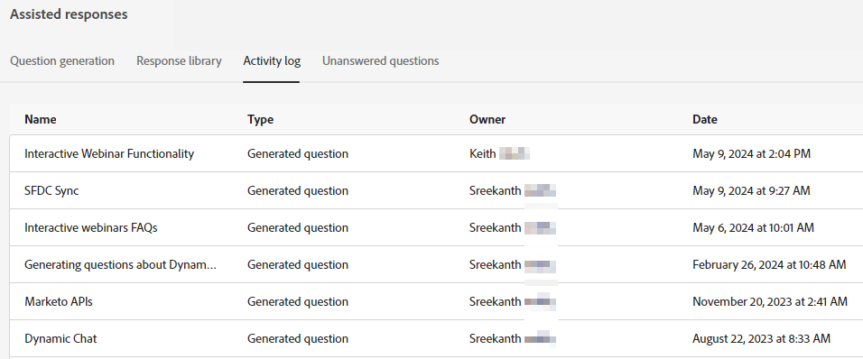
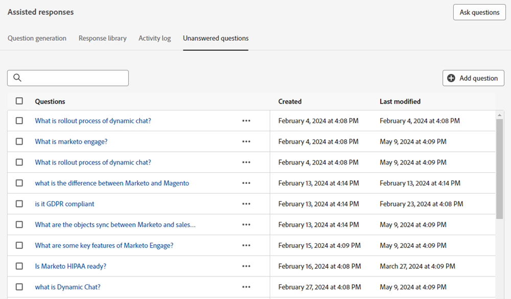
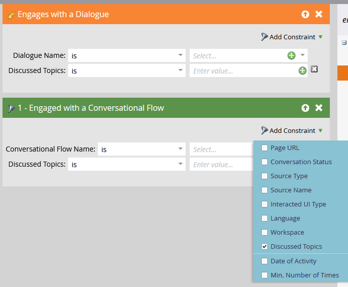

# Generative AI概述 {#generative-ai-overview}

Adobe Dynamic Chat中的創作AI會即時處理意圖訊號、使用者偏好設定和過去行為，為聊天訪客產生相關的個人化訊息。

## 權限 {#permissions}

若要使用創作AI，請務必授予所需使用者適當的 [許可權](/help/marketo/product-docs/demand-generation/dynamic-chat/setup-and-configuration/permissions.md).

## 產生回應卡 {#generation-response-card}

當訪客到達交談中的特定時間點時，建立訪客訊息。 設定他們可以一次詢問的若干問題，以獲得您想要的關鍵績效指標。 新增最多5個後續問題，並在沒有訪客問題的回應時包含遞補訊息。

## 交談摘要 {#conversation-summary}

通常要取得訪客交談的完整內容，您必須捲動瀏覽整個聊天記錄。 交談摘要會即時為您產生摘要，甚至包括訪客表示有興趣的主題。 這對於需要在與多位訪客的聊天之間切換時快速設定交談內容的聊天代理程式特別有用。 除了顯示在「代理程式收件匣」聊天畫面之外，您也可以在訪客個人記錄的Marketo Engage記錄檔（位於您的活動資料庫中）中找到已完成的交談摘要。

>[!NOTE]
>
>即時和自動聊天都會產生交談摘要。

## 問題產生 {#question-generation}

[提升傳入體驗](/help/marketo/product-docs/demand-generation/dynamic-chat/generative-ai/question-generation.md) 使用經過銷售、行銷和產品知識培訓的介面，為訪客提供AI輔助對話。

## 回覆資料庫 {#response-library}

[產生自訂集合](/help/marketo/product-docs/demand-generation/dynamic-chat/generative-ai/response-library.md) 問題和答案的預設集，全部由您預先核准，以供在Generative AI聊天行銷活動中使用。

## 活動記錄 {#activity-log}

[檢視所有任務的清單](/help/marketo/product-docs/demand-generation/dynamic-chat/generative-ai/activity-log.md) 以及隨附的詳細資料，包括名稱、擁有者、型別、編輯者及編輯時間。

## 未回答的問題 {#unanswered-questions}

[建立其他預先核准的回應](/help/marketo/product-docs/demand-generation/dynamic-chat/generative-ai/unanswered-questions.md) 用於您的回應資料庫，其根據為先前交談中未回答問題的存放庫。

## 討論的主題 {#discussed-topics}

討論的主題可在智慧清單觸發器和篩選器中作為限制使用，可讓您更深入探究您的Dynamic Chat見解。

>[!IMPORTANT]
>
>使用創作AI時，您必須遵守 [Adobe Experience Cloud Generative AI使用手冊](https://www.adobe.com/legal/licenses-terms/adobe-dx-gen-ai-user-guidelines.html) 因此，我們可以確保以安全和負責的方式使用納入創作AI的Adobe Experience Cloud功能。

## 常見問題集 {#faq}

**創作AI是否可供所有Dynamic Chat使用者使用？**

Generative AI僅適用於Dynamic Chat Prime訂閱者。

**我可以產生的問答數量是否有限制？**

有。目前存在1000的期限限制。

**generative AI提供哪些語言？**

目前，generative AI僅支援英文。
