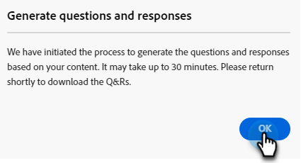

# 問題產生 {#question-generation}

檢視您的所有任務及其相關詳細資訊，例如產生時間、問題總數、核准狀態等。

## 產生問題 {#generate-questions}

1. 在Generative AI底下，按一下&#x200B;**[!UICONTROL 輔助回應]**。

   

1. 按一下&#x200B;**[!UICONTROL 產生問題]**。

   

1. 為工作命名，並輸入來源URL （最多10個），以擷取所有內容。 輸入想要的主題/關鍵字，然後在鍵盤上按Enter鍵。 完成時，按一下&#x200B;**[!UICONTROL 產生]**。

   

   >[!IMPORTANT]
   >
   >為了確保Marketo Engage可以從提供的URL中刮取內容，您必須先允許列出多個IP位址。 [請參閱以下詳細資料](#ip-addresses-to-allowlist)。

   >[!NOTE]
   >
   >網站/頁面必須是公開的（亦即不隱藏在登入後面），才能刮取其資訊。

1. 根據您的內容，產生問題和回應最多可能需要30分鐘。 按一下&#x200B;**[!UICONTROL 確定]**。

   

   >[!TIP]
   >
   >按一下重新整理以檢視產生問題的最新狀態。

   

## 下載問題和回應 {#download-questions-and-responses}

>[!NOTE]
>
>產生的問題和回應也可在[回應資料庫](/help/marketo/product-docs/demand-generation/dynamic-chat/generative-ai/response-library.md)中檢視。

1. 找到所需工作，然後按一下其名稱旁的下載圖示。

   

1. 在瀏覽器中找出下載資料夾，然後選取檔案。 根據您使用的瀏覽器，這可能看起來有所不同。

   

1. 在Excel檔案中，**[!DNL Task details]**&#x200B;會顯示有關工作的各種詳細資料，包括如何新增/編輯問題和/或回應的指示。

   

   >[!NOTE]
   >
   >如果您確實決定大量新增/編輯問題和/或回應，[請在此瞭解如何重新上傳它們](/help/marketo/product-docs/demand-generation/dynamic-chat/generative-ai/response-library.md)。

1. **[!DNL Q&Rs]**&#x200B;標籤提供其他詳細資料，包括產生的問題和回應。

   

## 允許清單的IP位址 {#ip-addresses-to-allowlist}

為了能夠在產生問題和回應期間從您的網頁URL擷取內容，請在下方找到您的地區，並確保您的網站團隊將與其相關聯的IP位址列入允許清單。

<table width="450">
<thead>
  <tr>
    <th>北美</th>
    <th>歐洲</th>
    <th>APAC</th>
  </tr>
</thead>
<tbody>
  <tr>
    <td>13.68.17.252</td>
    <td>20.105.150.224</td>
    <td>20.213.91.77</td>
  </tr>
</tbody>
</table>
