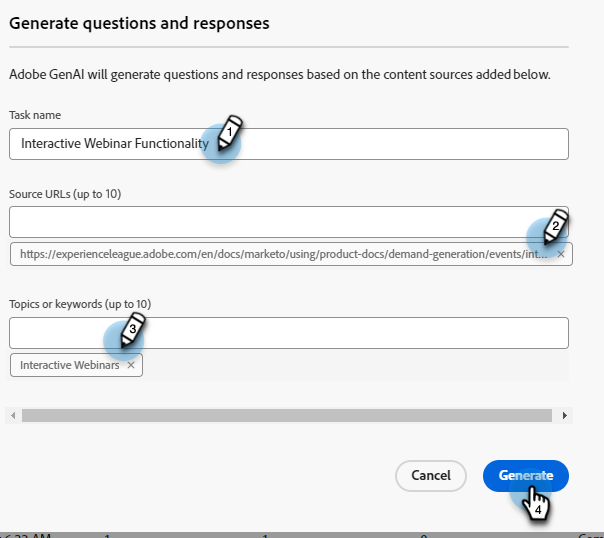

# 問題產生 {#question-generation}

檢視您的所有任務及其相關詳細資訊，例如產生時間、問題總數、核准狀態等。

## 產生問題 {#generate-questions}

1. 在Generative AI下，按一下 **協助回應**.

   

1. 按一下 **產生問題**.

   

1. 為工作命名，並輸入來源URL （最多50個），以擷取所有內容。 輸入想要的主題/關鍵字，然後在鍵盤上按Enter鍵。 完成後，按一下 **產生**.

   

   >[!IMPORTANT]
   >
   >為了確保Marketo Engage可以從提供的URL中刮取內容，您必須先允許列出多個IP位址。 [如需詳細資訊，請參閱下文](#ip-addresses-to-allowlist).

1. 根據您的內容，產生問題和回應最多可能需要30分鐘。 按一下 **確定**.

   

>[!TIP]
>
>頁面上的狀態不會即時更新。 點選重新整理以檢視從「處理」到「完成」的時間。

## 下載問題和回應 {#download-questions-and-responses}

>[!NOTE]
>
>產生的問題和回應也可在以下網址檢視： [回應程式庫](/help/marketo/product-docs/demand-generation/dynamic-chat/generative-ai/response-library.md).

1. 找到所需工作，然後按一下其名稱旁的下載圖示。

   

1. 在瀏覽器中找出下載資料夾，然後選取檔案。 視您的瀏覽器而定，這可能不盡相同。

   

1. 在Excel檔案中， **任務詳細資訊** 如此一來，畫面就會顯示工作的各種詳細資訊，包括如何新增/編輯問題和/或回應的指示。

   

   >[!NOTE]
   >
   >如果您確實決定大量編輯問題和/或回應， [在此處瞭解如何重新上傳它們](/help/marketo/product-docs/demand-generation/dynamic-chat/generative-ai/response-library.md).

1. 此 **Q&amp;R** 索引標籤提供其他詳細資訊，包括產生的問題和回應。

   

## 允許清單的IP位址 {#ip-addresses-to-allowlist}

為了能夠在產生問題和回應期間從您的網頁URL擷取內容，請確定您的網頁團隊已允許列出以下所有IP位址。

<table width="150">
  <tr>
    <td>20.167.0.149</td>
  </tr>
  <tr>
    <td>20.248.129.111</td>
  </tr>
  <tr>
    <td>20.167.0.146</td>
  </tr>
  <tr>
    <td>20.167.0.205</td>
  </tr>
  <tr>
    <td>20.248.135.80</td>
  </tr>
  <tr>
    <td>20.92.173.115</td>
  </tr>
  <tr>
    <td>20.167.0.195</td>
  </tr>
  <tr>
    <td>20.248.128.31</td>
  </tr>
  <tr>
    <td>20.167.1.48</td>
  </tr>
  <tr>
    <td>20.167.1.63</td>
  </tr>
  <tr>
    <td>20.167.1.92</td>
  </tr>
  <tr>
    <td>20.167.1.155</td>
  </tr>
  <tr>
    <td>20.248.135.132</td>
  </tr>
  <tr>
    <td>20.248.135.108</td>
  </tr>
  <tr>
    <td>20.248.134.140</td>
  </tr>
  <tr>
    <td>20.167.1.242</td>
  </tr>
  <tr>
    <td>20.167.0.198</td>
  </tr>
  <tr>
    <td>20.248.133.185</td>
  </tr>
  <tr>
    <td>20.248.134.190</td>
  </tr>
  <tr>
    <td>20.167.1.254</td>
  </tr>
  <tr>
    <td>20.248.128.118</td>
  </tr>
  <tr>
    <td>20.248.131.252</td>
  </tr>
  <tr>
    <td>20.167.0.188</td>
  </tr>
  <tr>
    <td>20.167.0.201</td>
  </tr>
  <tr>
    <td>20.211.64.11</td>
  </tr>
  <tr>
    <td>20.76.243.87</td>
  </tr>
  <tr>
    <td>20.76.244.212</td>
  </tr>
  <tr>
    <td>20.76.245.48</td>
  </tr>
  <tr>
    <td>20.76.245.76</td>
  </tr>
  <tr>
    <td>20.76.246.63</td>
  </tr>
  <tr>
    <td>20.76.246.146</td>
  </tr>
  <tr>
    <td>20.76.246.248</td>
  </tr>
  <tr>
    <td>20.76.247.92</td>
  </tr>
  <tr>
    <td>20.76.247.134</td>
  </tr>
  <tr>
    <td>20.76.247.244</td>
  </tr>
  <tr>
    <td>20.93.168.10</td>
  </tr>
  <tr>
    <td>20.93.168.44</td>
  </tr>
  <tr>
    <td>20.93.168.137</td>
  </tr>
  <tr>
    <td>20.93.169.20</td>
  </tr>
  <tr>
    <td>20.93.169.115</td>
  </tr>
  <tr>
    <td>20.93.169.214</td>
  </tr>
  <tr>
    <td>20.93.170.130</td>
  </tr>
  <tr>
    <td>20.93.170.138</td>
  </tr>
  <tr>
    <td>20.93.170.149</td>
  </tr>
  <tr>
    <td>20.93.172.63</td>
  </tr>
  <tr>
    <td>20.93.173.217</td>
  </tr>
  <tr>
    <td>20.93.173.243</td>
  </tr>
  <tr>
    <td>20.93.174.120</td>
  </tr>
  <tr>
    <td>20.93.174.159</td>
  </tr>
  <tr>
    <td>20.105.224.16</td>
  </tr>
  <tr>
    <td>20.10.235.102</td>
  </tr>
  <tr>
    <td>20.10.235.103</td>
  </tr>
  <tr>
    <td>20.10.235.143</td>
  </tr>
  <tr>
    <td>20.10.235.146</td>
  </tr>
  <tr>
    <td>20.10.235.147</td>
  </tr>
  <tr>
    <td>20.10.235.148</td>
  </tr>
  <tr>
    <td>20.10.235.188</td>
  </tr>
  <tr>
    <td>20.10.235.189</td>
  </tr>
  <tr>
    <td>20.10.235.246</td>
  </tr>
  <tr>
    <td>20.10.235.248</td>
  </tr>
  <tr>
    <td>20.10.235.255</td>
  </tr>
  <tr>
    <td>20.10.236.96</td>
  </tr>
  <tr>
    <td>20.10.236.97</td>
  </tr>
  <tr>
    <td>20.10.236.110</td>
  </tr>
  <tr>
    <td>20.10.236.111</td>
  </tr>
  <tr>
    <td>20.10.235.254</td>
  </tr>
  <tr>
    <td>20.10.236.138</td>
  </tr>
  <tr>
    <td>20.10.236.139</td>
  </tr>
  <tr>
    <td>20.10.236.140</td>
  </tr>
  <tr>
    <td>20.10.236.141</td>
  </tr>
  <tr>
    <td>20.10.236.84</td>
  </tr>
  <tr>
    <td>20.10.236.85</td>
  </tr>
  <tr>
    <td>20.10.236.86</td>
  </tr>
  <tr>
    <td>20.10.236.87</td>
  </tr>
  <tr>
    <td>20.119.144.14</td>
  </tr>
  <tr>
    <td>20.75.41.107</td>
  </tr>
  <tr>
    <td>20.75.43.104</td>
  </tr>
  <tr>
    <td>20.75.43.107</td>
  </tr>
  <tr>
    <td>20.75.43.113</td>
  </tr>
  <tr>
    <td>20.75.43.124</td>
  </tr>
  <tr>
    <td>20.75.43.204</td>
  </tr>
  <tr>
    <td>20.75.43.207</td>
  </tr>
  <tr>
    <td>20.75.43.214</td>
  </tr>
  <tr>
    <td>20.75.43.220</td>
  </tr>
  <tr>
    <td>20.75.44.0</td>
  </tr>
  <tr>
    <td>20.75.44.9</td>
  </tr>
  <tr>
    <td>20.75.44.52</td>
  </tr>
  <tr>
    <td>20.75.44.66</td>
  </tr>
  <tr>
    <td>20.75.44.82</td>
  </tr>
  <tr>
    <td>20.75.44.105</td>
  </tr>
  <tr>
    <td>20.75.44.108</td>
  </tr>
  <tr>
    <td>20.75.44.133</td>
  </tr>
  <tr>
    <td>20.75.44.135</td>
  </tr>
  <tr>
    <td>20.75.44.137</td>
  </tr>
  <tr>
    <td>20.75.44.147</td>
  </tr>
  <tr>
    <td>20.75.44.154</td>
  </tr>
  <tr>
    <td>20.75.44.195</td>
  </tr>
  <tr>
    <td>20.75.44.198</td>
  </tr>
  <tr>
    <td>20.75.45.32</td>
  </tr>
  <tr>
    <td>20.119.136.14</td>
  </tr>
  <tr>
    <td>172.177.93.157</td>
  </tr>
  <tr>
    <td>52.252.22.155</td>
  </tr>
  <tr>
    <td>20.62.18.64</td>
  </tr>
  <tr>
    <td>52.179.234.0</td>
  </tr>
  <tr>
    <td>52.179.234.1</td>
  </tr>
  <tr>
    <td>52.179.237.99</td>
  </tr>
  <tr>
    <td>52.179.237.148</td>
  </tr>
  <tr>
    <td>52.252.23.246</td>
  </tr>
  <tr>
    <td>52.253.64.47</td>
  </tr>
  <tr>
    <td>52.253.64.124</td>
  </tr>
  <tr>
    <td>52.253.64.125</td>
  </tr>
  <tr>
    <td>52.253.65.84</td>
  </tr>
  <tr>
    <td>52.253.65.85</td>
  </tr>
  <tr>
    <td>52.254.103.240</td>
  </tr>
  <tr>
    <td>52.253.65.92</td>
  </tr>
  <tr>
    <td>52.253.65.93</td>
  </tr>
  <tr>
    <td>52.177.89.135</td>
  </tr>
  <tr>
    <td>52.253.69.207</td>
  </tr>
  <tr>
    <td>52.253.69.240</td>
  </tr>
  <tr>
    <td>52.167.19.211</td>
  </tr>
  <tr>
    <td>52.177.147.229</td>
  </tr>
  <tr>
    <td>40.65.238.53</td>
  </tr>
  <tr>
    <td>52.177.147.249</td>
  </tr>
  <tr>
    <td>20.44.83.102</td>
  </tr>
  <tr>
    <td>52.177.148.19</td>
  </tr>
  <tr>
    <td>20.49.97.17</td>
  </tr>
  <tr>
    <td>20.14.171.7</td>
  </tr>
  <tr>
    <td>172.177.93.157</td>
  </tr>
  <tr>
    <td>20.213.91.77</td>
  </tr>
  <tr>
    <td>20.105.150.224</td>
  </tr>
  <tr>
    <td>13.68.17.252</td>
  </tr>
</table>