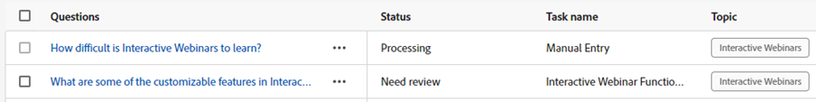

# 回應程式庫 {#response-library}

在一個位置檢視您所有的問題、其核准狀態，以及指派給它們的任務名稱/主題。

## 手動新增問題 {#manually-add-a-question}

1. 在Generative AI下，按一下 **協助回應**.

   

1. 按一下 **回應程式庫** 標籤。

   

1. 按一下 **新增問題**.

   

1. 輸入您的問題和回應。 指派主題並新增使用者可與訪客共用的選用URL。 按一下 **儲存** 完成時。

   

1. 按一下重新整理，您的新問題就會顯示在頂端，且狀態為「處理中」。

   

1. 幾分鐘後，再按一下，狀態會變更為「已核准」。

   

## 編輯個別問題/回應 {#generate-a-new-question}

>[!NOTE]
>
>依預設，所有產生的問題和回應都會被指派為「需要稽核」狀態。 只有「已核准」的問題和回應可供聊天訪客使用。

1. 在 **回應程式庫**，按一下所需的問題。

   

1. 進行所需的編輯，然後按一下 **儲存**.

   

## 大量編輯和上傳問題/回應 {#bulk-edit-and-upload-questions-responses}

1. 文字

熒幕擷圖

1. 文字

熒幕擷圖

1. 文字

熒幕擷圖

1. 文字

熒幕擷圖

## 篩選您的問題 {#filter-your-questions}

依預設，問題會依建立時間/日期依序列出，最新的問題會先顯示。 如果您正在尋找特定問題，請套用篩選器以縮小搜尋範圍。 依主題、任務名稱和/或核准狀態篩選。

熒幕擷圖
