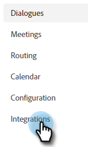

# Adobe Marketo Engage {#adobe-marketo-engage}

## 正在連線Dynamic Chat {#connecting-dynamic-chat}

在您完成[初始設定](/help/marketo/product-docs/demand-generation/dynamic-chat/setup-and-configuration/initial-setup.md){target="_blank"}後，就可以執行一次性的同步處理，將Dynamic Chat連線至您的Adobe Marketo Engage訂閱。

>[!NOTE]
>
>Dynamic Chat支援同步[Marketo native](https://experienceleague.adobe.com/en/docs/marketo-developer/marketo/rest/lead-database/field-types){target="_blank"}和自訂人員欄位和公司欄位。

1. 在「我的Marketo」中，按一下「**[!UICONTROL Dynamic Chat]**」圖磚。

   

   >[!NOTE]
   >
   >如果沒有看見圖磚，請聯絡您的Marketo管理員。

1. 如果您先前曾透過Adobe ID存取應用程式，您將會直接進入Dynamic Chat。 如果沒有，[請設定您的Adobe ID](https://helpx.adobe.com/manage-account/using/create-update-adobe-id.html){target="_blank"}。

1. 若要連線您的Marketo執行個體，請選取&#x200B;**[!UICONTROL Integrations]**。

   

1. 在Marketo卡上，按一下&#x200B;**[!UICONTROL Initiate Sync]**。

   

1. 從您的Marketo執行個體中選取最多50個屬性（標準或自訂欄位），以同步至Dynamic Chat，以用於對象目標定位、資料對應和個人化。 完成時，按一下&#x200B;**[!UICONTROL Next]**。

   

1. 檢閱您的選擇。 按一下&#x200B;**[!UICONTROL Confirm]**&#x200B;以啟動同步處理。

   

>[!NOTE]
>
>同步作業可能需要2到24小時才能完成，視資料庫大小而定。

## 新增屬性 {#add-an-attribute}

初次同步之後，以下說明如何新增其他屬性。

1. 在&#x200B;**[!UICONTROL Integrations]**&#x200B;中，確定已選取&#x200B;**[!UICONTROL Adobe Marketo Engage]**&#x200B;索引標籤並按一下&#x200B;**[!UICONTROL Add Attribute]**。

   

1. 選取您要新增的屬性，然後按一下&#x200B;**[!UICONTROL Next]**。

   

1. 檢閱您的選取並按一下&#x200B;**[!UICONTROL Confirm]**。

   

## 移除屬性 {#remove-an-attribute}

在初始同步之後，以下說明如何移除屬性。

>[!NOTE]
>
>只有屬性目前未被任何對話方塊使用時，您才會看到移除屬性的選項。

1. 在&#x200B;**[!UICONTROL Integrations]**&#x200B;中，確定已選取&#x200B;**[!UICONTROL Adobe Marketo Engage]**&#x200B;索引標籤，然後按一下您要移除的屬性。

   

1. 按一下「**[!UICONTROL Remove Attribute]**」。

   

>[!MORELIKETHIS]
>
>[初始設定](/help/marketo/product-docs/demand-generation/dynamic-chat/setup-and-configuration/initial-setup.md){target="_blank"}
