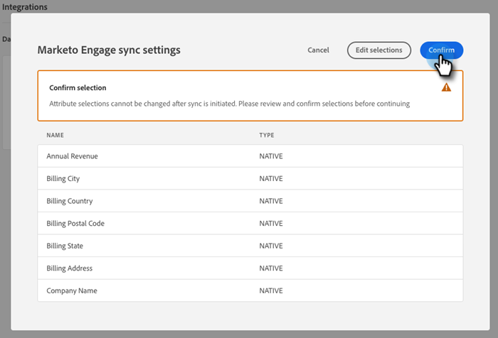

# 將動態聊天連接到Marketo {#connect-dynamic-chat-to-marketo}

## 連接動態聊天 {#connecting-dynamic-chat}

在您完成 [初始設定](/help/marketo/product-docs/demand-generation/dynamic-chat/initial-setup.md){target=&quot;_blank&quot;}，現在是時候執行一次同步，將動態聊天連接到您的Marketo訂閱。

1. 在「我的Marketo」中，按一下 **動態聊天** 平鋪。

   

   >[!NOTE]
   >
   >如果看不到磁貼，請聯繫您的Marketo管理員。

1. 如果您以前曾與Adobe ID聯繫過應用程式，您將直接轉到動態聊天。 如果沒有， [設定你的Adobe ID](https://helpx.adobe.com/manage-account/using/create-update-adobe-id.html){target=&quot;_blank&quot;}。

1. 要連接您的Marketo實例，請選擇 **整合**。

   

1. 在Marketo卡上，按一下 **啟動同步**。

   

1. 從您的Marketo實例中最多選擇50個屬性（標準或自定義欄位）以同步到動態聊天，以用於受眾目標、資料映射和個性化。 按一下 **下一個** 完成。

   

1. 查看您的選擇。 按一下 **確認** 啟動同步。

   

>[!NOTE]
>
>同步可能需要2到24小時的任意時間完成，具體取決於資料庫的大小。

## 添加屬性 {#add-an-attribute}

初始同步後，下面是如何添加附加屬性。

1. 在 **整合**，確保 **Adobe Marketo Engage** 頁籤，然後按一下 **添加屬性**。

   

1. 選擇要添加的屬性，然後按一下 **下一個**。

   

1. 查看您的選擇，然後按一下 **確認**。

   

## 刪除屬性 {#remove-an-attribute}

在初始同步後，下面是如何刪除屬性。

>[!NOTE]
>
>僅當屬性當前未被任何對話框使用時，您才會看到刪除該屬性的選項。

1. 在 **整合**，確保 **Adobe Marketo Engage** 頁籤，然後按一下要刪除的屬性。

   

1. 按一下 **刪除屬性**。

   

>[!MORELIKETHIS]
>
>[初始設定](/help/marketo/product-docs/demand-generation/dynamic-chat/initial-setup.md){target=&quot;_blank&quot;
