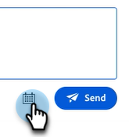

# 專員收件匣 {#agent-inbox}

代理程式將會在「代理程式收件匣」中欄位即時聊天。 除了使用中的交談之外，他們可以看到過去的交談、訪客資訊等。

## 可用性切換 {#availability-toggle}

在「代理程式收件匣」畫面的右上角，您可以選擇將您的狀態設定為「可用」或「無法使用」。

>[!IMPORTANT]
>
>**這將覆蓋** 此 [即時聊天可用性](/help/marketo/product-docs/demand-generation/dynamic-chat/setup-and-configuration/agent-settings.md#live-chat-availability){target="_blank"} 您已在[代理程式設定]中建立。 狀態會一直保留，直到您將其切換回或在您的可用性中切換至下一個時間區塊為止。

>[!NOTE]
>
>將您的狀態設定為無法使用不會影響任何作用中的聊天。

## 即時聊天通知 {#live-chat-notifications}

進一步瞭解 [即時聊天總覽](/help/marketo/product-docs/demand-generation/dynamic-chat/live-chat/live-chat-overview.md#live-chat-notifications){target="_blank"}.

## 交談 {#conversations}

在[代理程式收件匣]畫面的左側，您可以選擇只顯示作用中的交談，或顯示所有的交談。

>[!NOTE]
>
>雖然您可以看到自己和其他代理程式過去（非作用中）的交談，但您只能看到自己的作用中交談。

## 訪客資訊 {#visitor-information}

在「代理程式收件匣」畫面的右側，您可以（從上到下）看到其收件者：姓名、職稱、電子郵件地址、電話號碼和CRM狀態。 任何未傳遞的資訊都會顯示為破折號(-)。

## 活動歷史記錄 {#activity-history}

訪客資訊下方是活動歷史記錄。 檢視活動型別和日期，甚至檢視聊天記錄。

>[!NOTE]
>
>只會顯示過去90天的資訊。

## 行事曆共用 {#calendar-sharing}

即時聊天視窗底部是一個圖示，可讓您與聊天訪客共用您或其他代理程式的行事曆。

1. 按一下日曆圖示。

   

1. 選擇所需的代理程式行事曆並按一下 **傳送**.

   

1. 聊天訪客將能夠預約會議。

   
