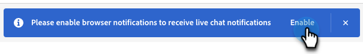

# 即時聊天總覽 {#live-chat-overview}

即時聊天可讓網站訪客與銷售代理進行即時聊天交談。

>[!NOTE]
>
>若您是Dynamic Chat Select套件上的使用者，即時聊天功能為試用功能，期限限製為100次參與。 當達到此限制時，所有要求與即時代理程式交談的訪客都不會連線，而是會收到全域遞補訊息。 若要提高上限，請聯絡您的Adobe客戶代表，討論套件升級選項。

## 新增即時聊天代理 {#add-live-chat-agents}

若要開始進行即時交談，您必須將即時聊天代理程式新增為Adobe Admin Console中的[使用者](/help/marketo/product-docs/demand-generation/dynamic-chat/setup-and-configuration/add-or-remove-chat-users.md#add-a-chat-user){target="_blank"}，並授予他們[即時聊天許可權](/help/marketo/product-docs/demand-generation/dynamic-chat/setup-and-configuration/permissions.md){target="_blank"}。 完成之後，您就可以將[即時聊天卡](#using-the-live-chat-card)新增至新的或現有的對話方塊。

當訪客透過您的對話方塊要求與代理程式聊天時，代理程式將有多個[通知選項](/help/marketo/product-docs/demand-generation/dynamic-chat/live-chat/agent-inbox.md#live-chat-notifications){target="_blank"}。 當他們按一下通知時，就會被帶往他們的[代理程式收件匣](/help/marketo/product-docs/demand-generation/dynamic-chat/live-chat/agent-inbox.md){target="_blank"}，在那裡他們可以開始與訪客聊天。

>[!NOTE]
>
>即時代理程式頭像會使用代理程式的Adobe帳戶設定檔中的設定檔圖片。 若要更新影像，請執行[這些步驟](https://helpx.adobe.com/tw/manage-account/using/edit-adobe-account-personal-profile.html){target="_blank"}。

## 使用即時聊天卡 {#using-the-live-chat-card}

當您想要訪客與即時代理程式聊天時，請使用[串流Designer](/help/marketo/product-docs/demand-generation/dynamic-chat/automated-chat/stream-designer.md){target="_blank"}中的即時聊天卡。

>[!IMPORTANT]
>
>即時聊天卡必須一律為分支中的最後一張卡。 如果卡片放置在分支中的隨機點，可能會讓訪客突然將其連線到代理程式，感到驚訝。

### 最佳實務 {#best-practices}

* 在即時聊天卡之前使用問題卡詢問訪客是否想要連線。
* 訪客同意連線後，請使用資訊擷取卡片來收集部分資訊，例如名字/姓氏、電子郵件地址、職稱等。 （建議至少索取名字和電子郵件地址）。

## 即時聊天卡選項 {#live-chat-card-options}

按一下串流中的即時聊天卡片可讓您選擇訪客路由的方式。 從循環配置資源、代理程式、自訂規則或團隊中選擇。

<table> 
 <tbody> 
  <tr> 
   <td><b>循環配置資源</b></td>
   <td>聊天會依序指派給代理程式。</td>
  </tr> 
  <tr> 
   <td><b>專員</b></td>
   <td>選擇要接收聊天的特定代理程式。</td>
  </tr>
    <tr> 
   <td><b>自訂規則</b></td>
   <td>考慮將訪客路由到何處時，所有自訂規則都會循環使用。 如果訪客不符合任何自訂規則的資格，他們會收到<a href="/help/marketo/product-docs/demand-generation/dynamic-chat/setup-and-configuration/agent-management.md#live-chat-fallback" target="_blank">即時聊天備援訊息</a>。</td>
  </tr> 
  <tr> 
   <td><b>團隊</b></td>
   <td>選擇要接收聊天的特定團隊。 如果選取此選項，則會在該群組中指派循環配置資源。</td>
  </tr>
 </tbody> 
</table>

## 即時聊天通知 {#live-chat-notifications}

>[!IMPORTANT]
>
>為了接收即時聊天所需的瀏覽器通知，所有即時聊天代理程式必須在出現提示時啟用Dynamic Chat的瀏覽器通知。

### 啟用通知 {#enabling-notifications}

即時聊天代理程式在登入時會在熒幕上方看到橫幅，上面顯示「請啟用瀏覽器通知以接收即時聊天通知」。 按一下&#x200B;**啟用**。

然後，瀏覽器會提示即時聊天代理顯示通知。 按一下&#x200B;**允許**。

如果代理程式在允許瀏覽器後仍未收到瀏覽器通知，則可能需要在作業系統通知設定中啟用瀏覽器的通知：

適用於Mac的[步驟](https://support.apple.com/guide/mac-help/change-notifications-settings-mh40583/mac){target="_blank"}

適用於Windows的[步驟](https://support.microsoft.com/en-us/windows/change-notification-settings-in-windows-8942c744-6198-fe56-4639-34320cf9444e){target="_blank"}

### 當即時聊天被路由到代理程式時 {#when-a-live-chat-is-routed-to-an-agent}

當即時聊天路由給代理時，他們會看到畫面頂端的藍色橫幅要求他們接受，以及有助於防止錯過通知的通知音效。

>[!TIP]
>
>您也可以選擇設定瀏覽器通知，若您未登入Dynamic Chat，通知會提醒您。
>
>* 在[Google Chrome](https://support.google.com/chrome/answer/3220216?hl=en&amp;co=GENIE.Platform%3DDesktop){target="_blank"}中啟用瀏覽器通知
>* 在[Mozilla Firefox](https://support.mozilla.org/en-US/kb/push-notifications-firefox){target="_blank"}中啟用瀏覽器通知

### 失敗的動作通知 {#failed-action-notifications}

當會議預約或即時聊天等動作失敗時，使用者會透過電子郵件收到通知。

### 注意事項 {#things-to-note}

* 在「接受聊天」訊息逾時之前，代理程式有100秒的時間回應。 之後，訪客將會收到[遞補訊息](/help/marketo/product-docs/demand-generation/dynamic-chat/setup-and-configuration/agent-management.md#live-chat-fallback){target="_blank"}。 對於路由選項設為&#x200B;**團隊**&#x200B;的Dynamic Chat Prime訂閱者，將會在後援訊息出現之前再嘗試一個代理程式。
* 目前每個代理程式限製為10個即時聊天。

>[!MORELIKETHIS]
>
>[代理程式收件匣](/help/marketo/product-docs/demand-generation/dynamic-chat/live-chat/agent-inbox.md){target="_blank"}
