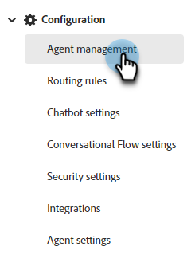
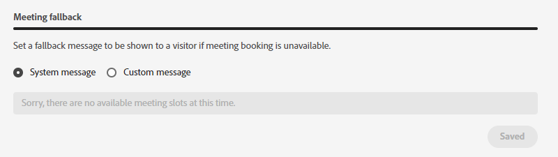

# 代理人管理 {#agent-management}

在「代理程式管理」中，檢視您Dynamic Chat執行個體中的代理程式清單、管理團隊並設定遞補規則。

## 專員 {#agents}

此標籤會列出您Dynamic Chat執行個體中的所有代理程式，並包含其名稱、電子郵件地址、即時聊天狀態等資訊。

{width="800" zoomable="yes"}

>[!NOTE]
>
>如果此處未顯示最近新增的代理程式，在Adobe Admin Console中新增代理程式後，最多可能需要兩個小時的時間。

## 團隊 {#teams}

管理員可以建立代理程式團隊，以方便路由至特定的銷售代理程式群組。

>[!AVAILABILITY]
>
>若要存取Teams需要Dynamic Chat Prime訂閱。 如需詳細資訊，請聯絡Adobe客戶團隊（您的客戶經理）。

### 建立團隊 {#create-a-team}

1. 按一下&#x200B;**+建立團隊**。

   

1. 為團隊命名。

   

1. 按一下&#x200B;**新增代理程式**&#x200B;下拉式清單，然後選取所需的代理程式。

   

1. 按一下&#x200B;**建立**。

   

## 遞補規則 {#fallback-rules}

### 會議遞補 {#meeting-fallback}

選取標準（系統）訊息或撰寫自訂訊息，讓訪客在無法預約會議時檢視。

### 即時聊天遞補 {#live-chat-fallback}

選取標準（系統）訊息或撰寫自訂訊息，讓訪客在即時聊天無法使用時檢視。

>[!NOTE]
>
>* 選取&#x200B;_包含會議預約選項_&#x200B;核取方塊會讓聊天訪客在沒有代理程式可供即時聊天時預約會議。
>
>* **對於任何自訂規則/團隊作為即時聊天卡**：檢查代理時，如果代理無法使用或無法連線，則會退回循環配置資源以嘗試「可用的代理」（所有當時可用的代理，無論將哪個路由邏輯/規則放在資料流中）。

>[!TIP]
>
>建立自訂訊息時，您可以設定字型樣式、使用連結，甚至插入表情符號。

## 設定 {#settings}

### 同時即時聊天限制 {#concurrent-live-chat}

設定代理程式一次可進行的同時作用中聊天數。 可設定1到10。

### 訪客等待時間限制 {#visitor-wait-time}

控制訪客在收到遞補訊息之前，等候連線至即時代理的最長時間（以秒為單位）。 可設定在10到500秒之間。

