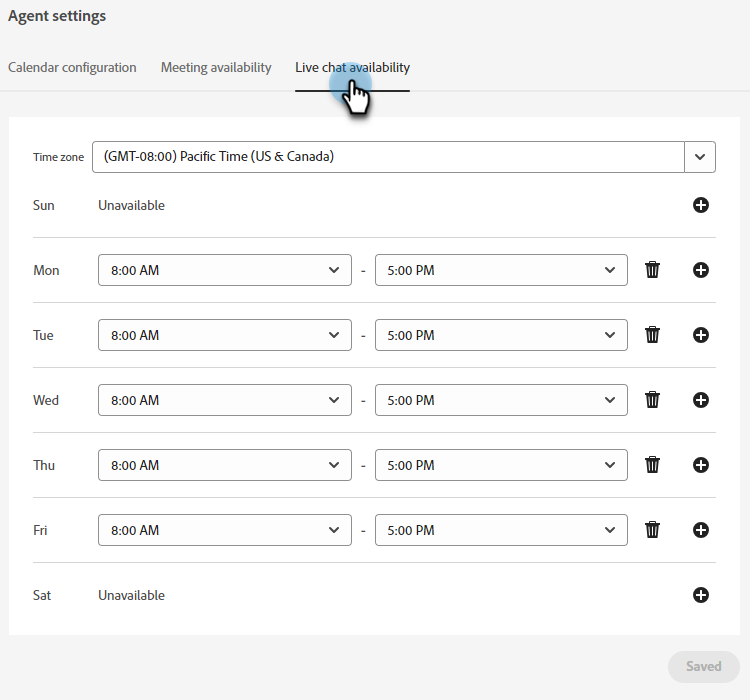

# 代理人設定 {#agent-settings}

設定行事曆並設定會議/即時聊天可用性。

>[!PREREQUISITES]
>
>請確定您的代理程式已被授與適當的[許可權](/help/marketo/product-docs/demand-generation/dynamic-chat/setup-and-configuration/permissions.md){target="_blank"}。

## 連線行事曆 {#connect-calendar}

在[行事曆設定]索引標籤中，連線您的Outlook或Gmail行事曆，以用於聊天機器人中的約會排程。

使用者的行事曆連線至Dynamic Chat後，即會新增至佇列，且網站訪客的行事曆可用於排程約會。

>[!NOTE]
>
>您可以為每個使用者連線一個行事曆。 如果您想要在多個行事曆上接收會議，您必須新增多個使用者，並讓每個使用者連線其行事曆。

使用者也可以在排程使用者行事曆上的約會時，自訂傳送給訪客的邀請內文。 他們也可以選取底部的核取方塊，以包含Google會議或Microsoft Teams連結（視連線的行事曆而定）。

>[!TIP]
>
>使用權杖圖示（大括弧），使用人員或公司屬性個人化您的會議預約確認電子郵件。

### 權限 {#permissions}

使用Outlook設定可授予Dynamic Chat下列許可權：

* 行事曆的完整存取權
* 登入並讀取您的設定檔
* 維護您授予其資料存取權的資料存取權
* 讀取您的信箱設定

使用Google設定可授予Dynamic Chat下列許可權：

* 建立、變更或刪除行事曆
* 更新個別的行事曆事件
* 變更您的設定，包括誰能看見您的活動
* 變更與誰共用行事曆
* 存取您的姓名、電子郵件地址、語言偏好設定和設定檔圖片

## 會議預約可用性 {#meeting-booking-availability}

設定您的時區與每週時間/日期以接收會議預約。

<table>
 <tbody>
  <tr>
   <td><b>會議持續時間</b></td>
   <td>決定訪客在可用的會議位置中看到的時間長度。</td>
  </tr>
  <tr>
   <td><b>會議之間的緩衝時間</b></td>
   <td>您設定為會議後緩衝的時間。 如果您設定30分鐘，則沒有人能夠在您的行事曆上排定的會議結束30分鐘之後與您預約會議。</td>
  </tr>
 </tbody>
</table>

>[!TIP]
>
>您可以按一下右側的&#x200B;_+_&#x200B;符號，選取同一天的多重時間區塊（例如，8a-12p **和** 1p-5p的星期五）。

## 即時聊天可用性 {#live-chat-availability}

設定您的時區以及每週時間/日期以接收即時聊天。

如果您已登入應用程式，您將會收到傳入聊天的應用程式內通知。 如果您未登入，將會收到瀏覽器通知（如果您已[設定](/help/marketo/product-docs/demand-generation/dynamic-chat/live-chat/agent-inbox.md#live-chat-notifications){target="_blank"}）。

>[!IMPORTANT]
>
>* 代理程式收件匣[中的](/help/marketo/product-docs/demand-generation/dynamic-chat/live-chat/agent-inbox.md#availability-toggle){target="_blank"}可用性切換&#x200B;**將覆寫**&#x200B;在&#x200B;_即時聊天可用性_&#x200B;索引標籤中輸入的內容。 因此，如果代理程式排程為1p-5p可用，但需要在3p進行快速中斷，則他們不需要變更其代理程式設定。 可用性切換狀態將保持到手動變更，直到到達代理程式的可用性中的下一個時間區塊，或直到代理程式的指定時區的午夜（如需詳細資訊，請參閱下一個專案符號）。
>
>* 當代理程式使用可用性切換將其狀態變更為「可用」時，其狀態會在可用性排程中指定的時區午夜自動重設（切換為不可用）。 如果未指定時區，則預設為UTC （世界協調時間）。

>[!TIP]
>
>您可以按一下右側的&#x200B;_+_&#x200B;符號，選取同一天的多重時間區塊（例如，8a-12p **和** 1p-5p的星期五）。

## 代理程式設定檔像片

雖然代理程式可以上傳自己的設定檔像片，但該動作不會在Dynamic Chat中執行。 他們需要導覽至`account.adobe.com/profile`。 在這裡瞭解更多： [更新您的帳戶設定檔](https://helpx.adobe.com/tw/manage-account/using/edit-adobe-account-personal-profile.html)。

>[!NOTE]
>
>`experience.adobe.com`中顯示的設定檔影像&#x200B;**不支援**。
