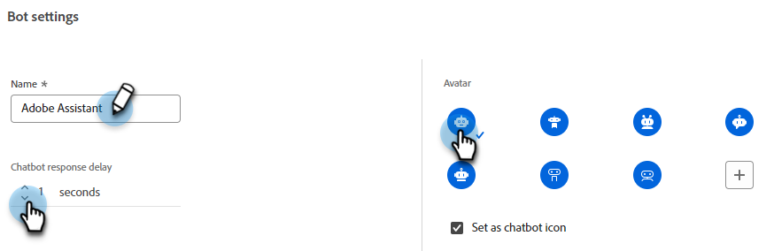
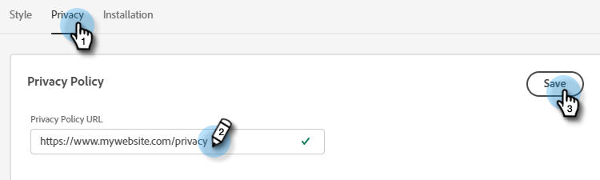

# 設定 {#configuration}

瞭解如何自訂聊天機器人對話視窗的外觀。

若要開始，請按一下&#x200B;**設定**&#x200B;下的&#x200B;**聊天機器人**。

有多種不同的自訂選項。

## 樣式標籤 {#style-tab}

### 樣式 {#style}

您將在此處定義顯示對話方塊的聊天機器人的外觀和風格，包括：顏色、字型、機器人Widget的位置以及聊天機器人的名稱/頭像。

每個類別的顏色由[十六進位顏色值](https://color.adobe.com/create/color-wheel){target="_blank"}決定(例如，白色= #ffffff、紅色= #bf1932等)。

錨點可讓您的網站訪客開啟/關閉對話方塊。 您可以選擇讓該圖示顯示在右下角或左下角。 您也可以增加/減少邊框間距（圖示與網頁底部之間的間距）。

### 機器人設定 {#agent-settings}

在「機器人設定」中，您可以將標籤新增至聊天箱(例如：「Adobe助理」)，標籤會顯示於聊天箱頂端。 您也可以判斷回應延遲（以秒為單位），並變更您的聊天頭像。 若要上傳您自己的顯示圖片影像，請按一下&#x200B;**+**&#x200B;按鈕。

>[!NOTE]
>
>自訂頭像應為小於256kb且小於200x200畫素的正方形影像。 支援的檔案型別包括： .jpg、.png、.gif、.webp、.svg。

**新訊息通知音效**

按一下下拉式清單，選取每次在工作階段中觸發聊天機器人時訪客的聲音。 有多種音效可供選擇。

**在行動裝置上啟用Poke訊息**

選取滑桿以啟用「撥號」（顯示在聊天圖示旁的開頭問題，訪客不需要按一下即可檢視），讓訪客從行動裝置聊天。

>[!NOTE]
>
>Poke只適用於交談中的前[張卡片](/help/marketo/product-docs/demand-generation/dynamic-chat/automated-chat/stream-designer.md#stream-designer-cards){target="_blank"}。

完成變更後，請記得按一下[儲存]。**&#x200B;**

## 隱私權索引標籤 {#privacy-tab}

按一下「**隱私權**」標籤，以新增/編輯網站隱私權原則的URL （選擇性）。

## 安裝標籤 {#installation-tab}

為了讓聊天機器人出現在您的網站上，您必須先安裝Dynamic Chat JavaScript程式碼片段。 按一下此標籤以尋找/複製必要的程式碼。 如果您不熟悉此作業，請連絡您的網站團隊或IT部門以尋求協助。

>[!TIP]
>
>如果您的網站使用Content-Security-Policy (CSP)，請檢視下方程式碼中的新增專案。

>[!NOTE]
>
>Marketo支援未設定為協助疑難排解HTML。 如需HTML的協助，請洽詢網頁開發人員。
