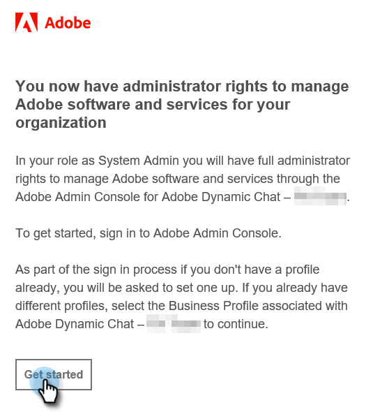

# 初始設定 {#initial-setup}

請依照下列步驟設定Dynamic Chat。

## 存取Admin Console {#access-admin-console}

>[!NOTE]
>
>**需要系統管理員許可權。**

1. 為您的Marketo執行個體啟用[!DNL Dynamic Chat]後，指定的系統管理員將會收到歡迎電子郵件。 在該電子郵件中，按一下&#x200B;**[!UICONTROL Get Started]**。

   

1. 如果您先前曾透過Adobe ID存取應用程式，您將會直接進入Adobe Admin Console。 如果沒有，[請設定您的Adobe ID](https://helpx.adobe.com/manage-account/using/create-update-adobe-id.html){target="_blank"}。

   

## 新增使用者 {#add-users}

1. 登入Admin Console後，接下來要做的就是新增使用者。 [記錄於此處](/help/marketo/product-docs/demand-generation/dynamic-chat/setup-and-configuration/add-or-remove-chat-users.md#add-a-chat-user){target="_blank"}。

接下來，是時候[將Dynamic Chat連線至Marketo](/help/marketo/product-docs/demand-generation/dynamic-chat/integrations/adobe-marketo-engage.md){target="_blank"}。
