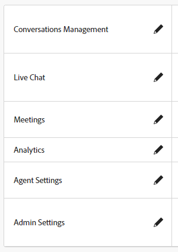
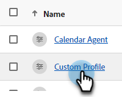

# 權限 {#permissions}

共有五個預設設定檔具有預先定義的許可權，您可以在Dynamic Chat中編輯。 您也可以建立具有自訂許可權集的自訂設定檔。 我們來看看這兩個。

## 編輯現有許可權 {#edit-existing-permissions}

1. 在 [Adobe Admin Console](https://adminconsole.adobe.com/){target="_blank"}，按一下 **Dynamic Chat**.

   

1. 在 **產品設定檔** 標籤，選取要編輯的設定檔。 在此範例中，我們選擇 **即時代理程式**.

   

1. 按一下 **許可權** 標籤。

   

1. 選取要編輯的設定檔區域。 在此範例中，我們選擇「即時交談」。 按一下鉛筆圖示。

   

1. 可用的許可權專案會列在左側。 您可以選擇逐一新增許可權，或一次新增所有許可權。 在此範例中，只有一個可用，因此我們將新增該專案。 按一下 **+** 簽署。

   

   >[!NOTE]
   >
   >啟用自動包含會將所有許可權專案新增至包含的清單。 當新的許可權專案可用時，會自動納入該產品設定檔中。

1. 按一下&#x200B;**保存**。

   

您現在可以為任何/所有其他Dynamic Chat區域重複此程式。

## 建立設定檔 {#create-a-profile}

1. 在 [Adobe Admin Console](https://adminconsole.adobe.com/){target="_blank"}，按一下 **Dynamic Chat**.

   

1. 在 **產品設定檔** 標籤，按一下 **新設定檔**.

   

1. **名稱** 您的產品設定檔。 您可以選擇為其提供顯示名稱和/或說明，並選擇在使用者新增/移除時通知使用者。 按一下 **儲存** 完成時。

   

1. 您的新設定檔會出現在產品設定檔索引標籤中。 選取它。

   

1. 現在請依照以下說明中的步驟3-6： [上一節](#edit-existing-permissions) 用於每個所需區域。

## 許可權清單 {#list-of-permissions}

在下方，您會找到每個區域的所有可用許可權清單。

<table>
<thead>
  <tr>
    <th style="width:25%">Dynamic Chat區域</th>
    <th>權限</th>
  </tr>
</thead>
<tbody>
  <tr>
    <td>交談管理</td>
    <td><li>檢視對話方塊</li>
    <li>管理對話方塊（建立、刪除）</li>
    <li>發佈對話方塊</li>
    <li>檢視對話流程</li>
    <li>管理對話流程（建立、刪除）</li>
    <li>發佈交談流程</li></td>
  </tr>
  <tr>
    <td>即時聊天</td>
    <td><li>檢視我的交談</li>
    <li>檢視所有交談</li>
  </tr>
  <tr>
    <td>會議</td>
    <td><li>管理所有會議</li>
  </tr>
  <tr>
    <td>Analytics</td>
    <td><li>檢視全域效能報表</li>
    <li>檢視即時聊天報告</li>
    <li>檢視會議報告</li>
    <li>匯出報告</li></td>
  </tr>
  <tr>
    <td>專員設定</td>
    <td><li>管理即時聊天可用性</li>
    <li>連線您的行事曆</li>
    <li>管理行事曆可用性</li></td>
  </tr>
  <tr>
    <td>管理員設定</td>
    <td><li>檢視循環配置資源</li>
    <li>檢視自訂規則</li>
    <li>管理自訂規則（新增、編輯、刪除）</li>
    <li>檢視帳戶清單 <b>*</b></li>
    <li>管理帳戶（新增、編輯、刪除） <b>*</b></li>
    <li>管理聊天機器人設定</li>
    <li>管理對話流程設定</li>
    <li>管理隱私權與安全性</li>
    <li>管理整合</li>
    <li>管理代理程式</li>
    <li>檢視代理程式團隊 <b>*</b></li>
    <li>管理代理程式團隊（新增、編輯、刪除） <b>*</b></li></td>
  </tr>
</tbody>
</table>

**&#42;** 目前僅適用於Dynamic Prime使用者

## 預設設定檔許可權 {#default-profile-permissions}

以下是預設啟用的五個預設設定檔和許可權。

<table>
<thead>
  <tr>
    <th style="width:25%">個人檔案</th>
    <th>預設許可權</th>
  </tr>
</thead>
<tbody>
  <tr>
    <td>行銷使用者</td>
    <td><i>交談管理</i>
    <li>檢視對話方塊</li>
    <li>管理對話方塊（建立、刪除）</li>
    <li>發佈對話方塊</li>
    <li>檢視對話流程</li>
    <li>管理對話流程（建立、刪除）</li>
    <li>發佈交談流程</li>
     
    <i>即時聊天</i>
    <li>不適用</li>
     
    <i>會議</i>
    <li>不適用</li>
     
    <i>Analytics</i>
    <li>檢視全域效能報表</li>
    <li>檢視即時聊天報告</li>
    <li>檢視會議報告</li>
     
    <i>專員設定</i>
    <li>不適用</li>
     
    <i>管理員設定</i>
    <li>檢視循環配置資源</li>
    <li>檢視自訂規則</li>
    <li>檢視帳戶清單 <b>*</b></li>
    <li>檢視代理程式團隊 <b>*</b></li>
    </td>
  </tr>
  <tr>
    <td><b>即時代理程式</b></td>
    <td><i>交談管理</i>
    <li>檢視對話方塊</li>
    <li>檢視對話流程</li>
     
    <i>即時聊天</i>
    <li>檢視我的交談</li>
     
    <i>會議</i>
    <li>不適用</li>
     
    <i>Analytics</i>
    <li>檢視全域效能報表</li>
    <li>檢視即時聊天報告</li>
    <li>檢視會議報告</li>
     
    <i>專員設定</i>
    <li>管理即時聊天可用性</li>
    <li>連線您的行事曆</li>
    <li>管理行事曆可用性</li>
     
    <i>管理員設定</i>
    <li>檢視循環配置資源</li>
    <li>檢視自訂規則</li>
    <li>檢視帳戶清單 <b>*</b></li>
    <li>檢視代理程式團隊 <b>*</b></li>
    </td>
  </tr>
  <tr>
    <td><b>行事曆代理程式</b></td>
    <td><i>交談管理</i>
    <li>檢視對話方塊</li>
    <li>檢視對話流程</li>
     
    <i>即時聊天</i>
    <li>不適用</li>
     
    <i>會議</i>
    <li>不適用</li>
     
    <i>Analytics</i>
    <li>檢視全域效能報表</li>
    <li>檢視即時聊天報告</li>
    <li>檢視會議報告</li>
     
    <i>專員設定</i>
    <li>連線您的行事曆</li>
    <li>管理行事曆可用性</li>
     
    <i>管理員設定</i>
    <li>檢視循環配置資源</li>
    <li>檢視自訂規則</li>
    <li>檢視帳戶清單 <b>*</b></li>
    <li>檢視代理程式團隊 <b>*</b></li>
    </td>
  </tr>
  <tr>
    <td><b>行銷管理員</b></td>
    <td><i>交談管理</i>
    <li>檢視對話方塊</li>
    <li>管理對話方塊（建立、刪除）</li>
    <li>發佈對話方塊</li>
    <li>檢視對話流程</li>
    <li>管理對話流程（建立、刪除）</li>
    <li>發佈交談流程</li>
     
    <i>即時聊天</i>
    <li>不適用</li>
     
    <i>會議</i>
    <li>不適用</li>
     
    <i>Analytics</i>
    <li>檢視全域效能報表</li>
    <li>檢視即時聊天報告</li>
    <li>檢視會議報告</li>
    <li>匯出報告</li>
     
    <i>專員設定</i>
    <li>不適用</li>
     
    <i>管理員設定</i>
    <li>檢視循環配置資源</li>
    <li>檢視自訂規則</li>
    <li>管理自訂規則（新增、編輯、刪除）</li>
    <li>檢視帳戶清單 <b>*</b></li>
    <li>管理帳戶（新增、編輯、刪除） <b>*</b></li>
    <li>管理聊天機器人設定</li>
    <li>管理對話流程設定</li>
    <li>管理隱私權與安全性</li>
    <li>管理整合</li>
    <li>檢視代理程式團隊 <b>*</b></li>
    </td>
  </tr>
  <tr>
    <td><b>銷售管理員</b></td>
    <td><i>交談管理</i>
    <li>檢視對話方塊</li>
    <li>檢視對話流程</li>
     
    <i>即時聊天</i>
    <li>檢視我的交談</li>
    <li>檢視所有交談</li>
     
    <i>會議</i>
    <li>管理所有會議</li>
     
    <i>Analytics</i>
    <li>檢視全域效能報表</li>
    <li>檢視即時聊天報告</li>
    <li>檢視會議報告</li>
    <li>匯出報告</li>
     
    <i>專員設定</i>
    <li>管理即時聊天可用性</li>
    <li>連線您的行事曆</li>
    <li>管理行事曆可用性</li>
     
    <i>管理員設定</i>
    <li>檢視循環配置資源</li>
    <li>檢視自訂規則</li>
    <li>管理自訂規則（新增、編輯、刪除）</li>
    <li>檢視帳戶清單 <b>*</b></li>
    <li>管理帳戶（新增、編輯、刪除） <b>*</b></li>
    <li>管理代理程式</li>
    <li>檢視代理程式團隊 <b>*</b></li>
    <li>管理代理程式團隊 <b>*</b></li>
    </td>
  </tr>
</tbody>
</table>

**&#42;** 目前僅適用於Dynamic Prime使用者
