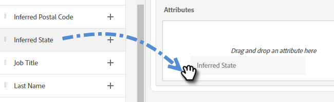
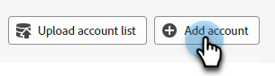

# 路由 {#routing}

在Dynamic Chat中預約的會議可以兩種方式路由。 循環配置資源，或使用自訂規則。

循環配置資源：會議會依序指派給代理程式。 因此，如果您有五個代理程式，而代理程式三參加最後一個會議，則代理程式四會取得下一個會議，接著是代理程式五，然後回到代理程式一。

自訂規則：您可以根據您選取的屬性選擇特定代理以接收會議。

>[!NOTE]
>
>帳戶路由會獲得最高優先順序。 當訪客到達交談點以預約會議或啟動即時交談時，會先檢查[帳戶路由](#account-routing)，然後再考慮其他路由選項。

## 建立自訂規則 {#create-a-custom-rule}

在此範例中，我們會將推斷的CA、OR和WA狀態的所有會議傳送給代理程式John。

1. 在[設定]下，按一下[路由規則]。****。

   

1. 預設會開啟&#x200B;**自訂規則**&#x200B;標籤。

   

1. 按一下&#x200B;**建立規則**。

   

1. 為規則命名。 您可以選擇新增說明並設定其優先順序層級。 按一下&#x200B;**下一步**。

   

1. 選擇所需的代理程式。

   

1. 拖曳到您所需的屬性上。

   

1. 尋找並選取所需的值。

   

1. 選取所有所需值時，按一下[儲存]。****

   

## 帳戶路由 {#account-routing}

識別並上傳您的目標帳戶與個別銷售負責人，並將來自這些帳戶的訪客直接路由至個別帳戶負責人。

>[!PREREQUISITES]
>
>在Dynamic Chat中看到&#x200B;_帳戶路由_&#x200B;之前，必須在Admin Console中啟用許可權。 請參閱下方的[啟用許可權](#enable-permissions)。

### 啟用許可權 {#enable-permissions}

+++ 啟用帳戶路由許可權

1. 登入[https://adminconsole.adobe.com/](https://adminconsole.adobe.com/){target="_blank"}。

1. 在&#x200B;_產品_&#x200B;底下，選取&#x200B;**Dynamic Chat**。

   

1. 在&#x200B;_產品設定檔_&#x200B;下，選取所需的設定檔。

   

1. 按一下「**許可權**」標籤。

   

1. 按一下旁的編輯圖示（_編輯圖示_）。

   

1. 按一下&#x200B;**檢視帳戶路由**&#x200B;旁的&#x200B;_+_&#x200B;符號。

   {width="600" zoomable="yes"}

1. 完成時，按一下&#x200B;**儲存**。

+++

### 新增帳戶 {#add-an-account}

在此範例中，我們會直接將所有員工從樂高路由到代理程式Steven。

1. 在[帳戶路由]索引標籤中，按一下[**+新增帳戶**]。

   

   >[!TIP]
   >
   >您可以按一下&#x200B;**上傳帳戶清單**&#x200B;並上傳CSV，一次建立多個帳戶。

1. 輸入公司名稱、網域，然後選取所需的代理程式。

   
