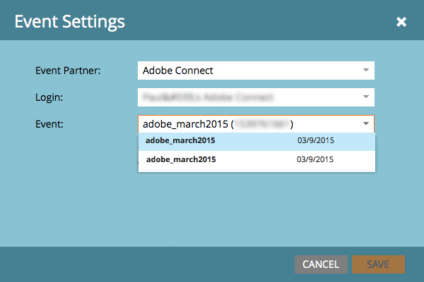

# 使用 Adobe Connect 建立事件 {#create-an-event-with-adobe-connect}

與Adobe Connect同步可讓您在Marketo中管理網路研討會註冊和出席情況，以確保不會取消追蹤參與情形。

>[!PREREQUISITES]
>
>* [連結Adobe Connect和Marketo](/help/marketo/product-docs/administration/additional-integrations/add-adobe-connect-as-a-launchpoint-service.md)
>* [建立新的活動程式](/help/marketo/product-docs/demand-generation/events/understanding-events/create-a-new-event-program.md)

首先，確定您已在Adobe Connect中建立會議或研討會。 如果您需要協助，請檢視[Adobe Connect使用手冊](https://help.adobe.com/en_US/connect/9.0/using/index.html)。

您在Adobe Connect中建立的會議和研討會，必須在您在Marketo中輸入認證時指定的資料夾下建立。 建立會議或研討會後，記下任何相關的後勤資訊（例如電話號碼），以便用於確認電子郵件和ICS檔案。

>[!CAUTION]
>
>作為活動主持人，請確定從應用程式內加入，並且&#x200B;**不**&#x200B;透過傳送給出席者的連結。

>[!NOTE]
>
>我們目前不支援Adobe Connect On-Site。

1. 在新事件的首頁上，選取&#x200B;**[!UICONTROL Event Actions]**，然後選取&#x200B;**[!UICONTROL Event Settings]**。

   

   >[!NOTE]
   >
   >如果您在下拉式清單中看不到&#x200B;**[!UICONTROL Event Settings]**，請確定事件頻道已在「**[!UICONTROL Event with Webinar]**」下選取[!UICONTROL Applies to]。

1. 在&#x200B;**[!UICONTROL Event Partner]**&#x200B;下，選取&#x200B;**[!UICONTROL Adobe Connect]**。

   

1. 選取您的&#x200B;**[!UICONTROL Login]** ID並選取您的&#x200B;**[!UICONTROL Event]**。

   

1. 按一下「**[!UICONTROL Save]**」。

   

   很好！ 您的Adobe Connect事件現在已與您的Marketo事件同步。

   >[!NOTE]
   >
   >Marketo傳送的欄位有：名字、姓氏、電子郵件地址。

   >[!TIP]
   >
   >若要將個人的唯一URL插入電子郵件中，請使用此Token： `{{member.webinar url}}`。 在傳送電子郵件時，此Token會自動從Adobe Connect解析個人的唯一確認URL。
   >
   >將您的確認電子郵件設定為&#x200B;**營運**，以確保註冊及可能取消訂閱的人員仍會收到其確認資訊。

   當[!UICONTROL Change Program Status]設為「已註冊」時，註冊您的網路研討會的人將透過[!UICONTROL New Status]流程步驟推送至您的網路研討會提供者。 沒有其他狀態會將人員推到。 此外，請務必將[!UICONTROL Change Program Status]流程步驟#1定為，[!UICONTROL Send Email]流程步驟#2定為。

   

   >[!CAUTION]
   >
   >避免使用巢狀電子郵件程式來傳送確認電子郵件。 請改用事件程式的智慧型行銷活動，如上所示。

   >[!TIP]
   >
   >資料可能需要48小時才會出現在Marketo中。 如果等了這麼久後您仍然看不到任何內容，請從事件的[摘要]索引標籤的[事件動作]功能表中選取&#x200B;**[!UICONTROL Refresh from Webinar Provider]**。

   >[!MORELIKETHIS]
   >
   >* [將Adobe Connect新增為 [!DNL LaunchPoint] 服務](/help/marketo/product-docs/administration/additional-integrations/add-adobe-connect-as-a-launchpoint-service.md)
   >* [編輯事件頻道](/help/marketo/product-docs/demand-generation/events/understanding-events/edit-an-event-channel.md)
