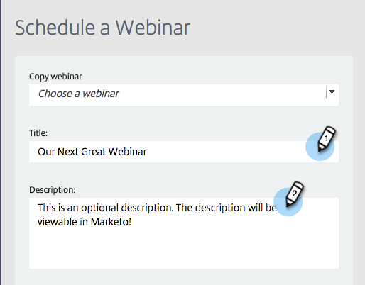

# 使用GotoWebinar建立事件 {#create-an-event-with-gotowebinar}

>[!PREREQUISITES]
>
>* [將GoToWebinar新增為LaunchPoint服務](/help/marketo/product-docs/administration/additional-integrations/add-gotowebinar-as-a-launchpoint-service.md)
>* [建立新的事件程式](/help/marketo/product-docs/demand-generation/events/understanding-events/create-a-new-event-program.md)
>* 設定適當的 [流程動作](/help/marketo/product-docs/core-marketo-concepts/smart-campaigns/flow-actions/add-a-flow-step-to-a-smart-campaign.md)以追蹤參與

請先在GoTo網路研討會中建立您的網路研討會。 Marketo會使用建立您的GoTo網路研討會中的某些設定，而某些設定僅供GoTo網路研討會使用。

在您建立Marketo活動並建立GoToWebinar與其關聯後，系統便能共用註冊和出席資訊。

以下為Marketo使用的設定清單。

## 標題和說明 {#title-and-description}

**網路研討會名稱**  — 輸入網路研討會的名稱。 此名稱可在Marketo中檢視。

**說明** （選用） — 輸入網路研討會的說明。 此說明可在Marketo中檢視。

## 日期與時間 {#date-time}

為您的網路研討會輸入下列資訊，這些資訊會透過轉接器提取到Marketo中。 如果您對此資訊進行變更，則必須按一下連結»**從網路研討會提供者重新整理**「，在 **事件動作**，以便Marketo檢視變更。

**開始日期**  — 輸入您的開始日期。 您可在Marketo中檢視此內容。

**開始時間**  — 輸入您的開始時間。 您可在Marketo中檢視此內容。

**結束時間**  — 輸入您的結束時間。 您可在Marketo中檢視此內容。

**時區**  — 選取適用的時區。 它可在Marketo中檢視。

**型別 —** 設定為 **一個工作階段**.

>[!NOTE]
>
>Marketo目前不支援定期網路研討會。 在每個Marketo活動和GoToWebinar網路研討會之間，您必須設定單一工作階段。

>[!TIP]
>
>如果您需要其他的GoTo網路研討會說明，請造訪他們的 [說明網站](https://support.logmeininc.com/gotowebinar).

現在，讓我們跳至Marketo！

1. 選取事件。 按一下 **事件動作** 並選擇 **事件設定**.

   

   >[!NOTE]
   >
   >所選事件的管道型別必須是 **網路研討會**.

1. 選擇 **GoTo網路研討會** 從 **活動合作夥伴** 清單。

   

1. 選擇帳戶。

   

1. 選取網路研討會。

   

1. 按一下 **儲存**.

   

1. 太棒了！ 現在事件已同步並排程，執行者為 **GoTo網路研討會**.

   

   >[!NOTE]
   >
   >Marketo傳送的欄位有：名字、姓氏、電子郵件地址。 這些欄位為必填欄位，不得為空白。

   >[!TIP]
   >
   >若要使用此唯一URL填入您的確認電子郵件，請在電子郵件中使用下列權杖： `{{member.webinar url}}`. 當送出確認URL時，此權杖會自動解析為個人的唯一確認URL。
   >
   >將您的確認電子郵件設定為 **運作** 以確保註冊和可能取消訂閱的人仍會收到其確認資訊。

   

   >[!CAUTION]
   >
   >避免使用巢狀電子郵件程式傳送確認電子郵件。 請改用事件程式的智慧型行銷活動，如上所示。

   >[!TIP]
   >
   >資料可能需要48小時才會出現在Marketo中。 如果等了這麼久仍未看到任何內容，請選取 **從網路研討會提供者重新整理** 從「事件動作」功能表 **摘要** 索引標籤進行識別。

當「新狀態」設為「已註冊」時，註冊您的網路研討會的人將透過「變更計畫狀態」流程步驟推送至您的網路研討會提供者。 沒有其他狀態會將人員推到。 此外，請務必將「變更計畫狀態」流程步驟設為#1，並將「傳送電子郵件流程」步驟設為#2。

## 檢視排程  {#viewing-the-schedule}

在方案排程檢視中，按一下您事件的行事曆專案。 您可在畫面右側檢視排程。

>[!NOTE]
>
>若要變更您的活動排程，您必須在GoToWebinar上編輯網路研討會。

