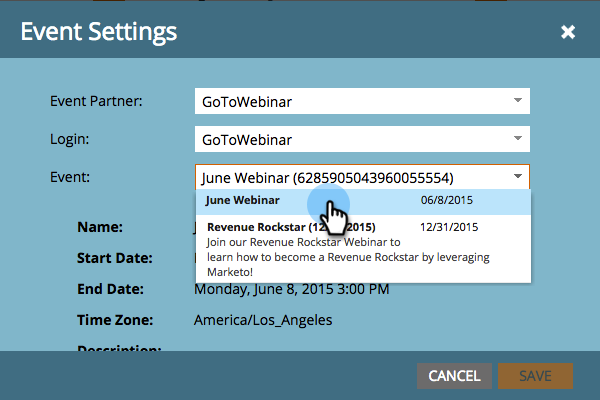

# 建立具有[!DNL GotoWebinar]的事件 {#create-an-event-with-gotowebinar}

>[!PREREQUISITES]
>
>* [新增 [!DNL GoToWebinar] 為 [!DNL LaunchPoint] 服務](/help/marketo/product-docs/administration/additional-integrations/add-gotowebinar-as-a-launchpoint-service.md)
>* [建立新的活動程式](/help/marketo/product-docs/demand-generation/events/understanding-events/create-a-new-event-program.md)
>* 設定適當的[流程動作](/help/marketo/product-docs/core-marketo-concepts/smart-campaigns/flow-actions/add-a-flow-step-to-a-smart-campaign.md)以追蹤參與

請先在[!DNL GoToWebinar]中建立您的網路研討會。 建立您的[!DNL GoToWebinar]時，Marketo會使用某些設定，而只有[!DNL GoToWebinar]會使用某些設定。

在您建立Marketo活動並與[!DNL GoToWebinar]建立關聯後，系統便能共用註冊與出席資訊。

以下為Marketo所使用的設定清單。

## 標題和說明 {#title-and-description}

**[!UICONTROL Title]** — 輸入網路研討會的名稱。 您可在Marketo中檢視此名稱。

**[!UICONTROL Description]** （選擇性） — 輸入網路研討會的說明。 此說明可在Marketo中檢視。

## 日期與時間 {#date-time}

為您的網路研討會輸入下列資訊，這些資訊會透過轉接器提取到Marketo中。 若您變更此資訊，您必須按一下&#x200B;**[!UICONTROL Refresh from Webinar Provider]**&#x200B;底下的連結&quot;**[!UICONTROL Event Actions]**&quot;，Marketo才能看到變更。

**[!UICONTROL Start Date]** — 輸入您的開始日期。 您可在Marketo中檢視此內容。

**[!UICONTROL Start Time]** — 輸入您的開始時間。 您可在Marketo中檢視此內容。

**[!UICONTROL End Time]** — 輸入您的結束時間。 您可在Marketo中檢視此內容。

**[!UICONTROL Webinar Time Zone]** — 選取適用的時區。 它可在Marketo中檢視。

**[!UICONTROL Type]** — 設定為&#x200B;**[!UICONTROL One Session]**。

>[!NOTE]
>
>Marketo目前不支援定期網路研討會。 在每個Marketo活動與[!DNL GoToWebinar]網路研討會之間，您必須設定單一工作階段。

>[!TIP]
>
>若您需要其他[!DNL GoToWebinar]說明，請造訪他們的[說明網站](https://support.logmeininc.com/gotowebinar)。

現在，讓我們跳入Marketo！

1. 選取事件。 按一下&#x200B;**[!UICONTROL Event Actions]**&#x200B;並選擇&#x200B;**[!UICONTROL Event Settings]**。

   

   >[!NOTE]
   >
   >所選事件的頻道型別必須是&#x200B;**網路研討會**。

1. 從&#x200B;**[!UICONTROL GoToWebinar]**&#x200B;清單中選擇&#x200B;**[!UICONTROL Event Partner]**。

   

1. 選擇帳戶。

   

1. 選取網路研討會。

   

1. 按一下「**[!UICONTROL Save]**」。

   

1. 太好了！ **[!DNL GoToWebinar]**&#x200B;現在已同步並排程此事件。

   

   >[!NOTE]
   >
   >Marketo傳送的欄位有：名字、姓氏、電子郵件地址。 這些欄位為必要項，且不得為空白。

   >[!TIP]
   >
   >若要以這個唯一的URL填入您的確認電子郵件，請在電子郵件中使用下列權杖： `{{member.webinar url}}`。 送出確認URL時，此Token會自動解析為個人唯一的確認URL。
   >
   >將您的確認電子郵件設定為&#x200B;**營運**，以確保註冊及可能取消訂閱的人員仍會收到其確認資訊。

   

   >[!CAUTION]
   >
   >避免使用巢狀電子郵件程式來傳送確認電子郵件。 請改用事件程式的智慧型行銷活動，如上所示。

   >[!TIP]
   >
   >資料可能需要48小時才會出現在Marketo中。 如果等了這麼久後您仍然看不到任何內容，請從您事件的「**[!UICONTROL Refresh from Webinar Provider]**」標籤中的「[!UICONTROL Event Actions]」功能表選取「**[!UICONTROL Summary]**」。

當[!UICONTROL Change Program Status]設為「已註冊」時，註冊您的網路研討會的人將透過[!UICONTROL New Status]流程步驟推送至您的網路研討會提供者。 沒有其他狀態會將人員推到。 此外，請務必將[!UICONTROL Change Program Status]流程步驟#1定為，[!UICONTROL Send Email]流程步驟#2定為。

## 檢視排程  {#viewing-the-schedule}

在方案排程檢視中，按一下您事件的行事曆專案。 您可在畫面右側檢視排程。

>[!NOTE]
>
>若要變更您的活動排程，您需要在[!DNL GoToWebinar]編輯網路研討會。

