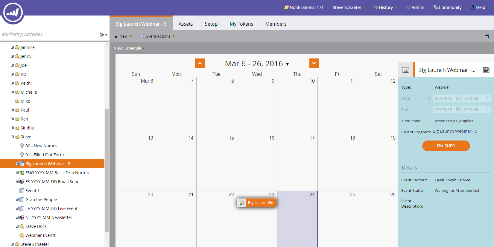

# 建立具有第3級Web會議的事件 {#create-an-event-with-level-web-meeting}

>[!PREREQUISITES]
>
>* [將第3級Web會議新增為LaunchPoint服務](/help/marketo/product-docs/administration/additional-integrations/add-level-3-web-meeting-as-a-launchpoint-service.md)
>* [建立新的事件程式](/help/marketo/product-docs/demand-generation/events/understanding-events/create-a-new-event-program.md)
>* 設定適當的 [流程動作](/help/marketo/product-docs/core-marketo-concepts/smart-campaigns/flow-actions/add-a-flow-step-to-a-smart-campaign.md)以追蹤參與

請先在3級中建立您的網路研討會。 如果您需要協助，請檢視 [第3級資源庫](https://www.level3.com/en/resource-library/). 您會發現它與BrightTalk非常類似。  Marketo使用小部分第3層欄位：

* **名稱**  — 網路廣播的名稱。
* **開始日期**  — 網路廣播的開始日期。
* **結束日期**  — 網路廣播的結束日期。
* **時區**  — 為網路廣播設定的時區。
* **說明**  — 網路廣播說明。

1. 選取您的新事件。 按一下 **事件動作，** 則 **事件設定。**

   

1. 在「事件合作夥伴」底下，選取 **第3級Web會議**.

   

1. 在「登入」下，選取您的Level 3登入。

   

1. 在「事件」底下，選擇您要使用的第3級事件。

   

1. 按一下 **儲存**.

   

   最棒！ 您已將活動連結至第3級！

## 檢視排程  {#viewing-the-schedule}

在方案排程檢視中，按一下您事件的行事曆專案。 您可在熒幕右側看到排程！

