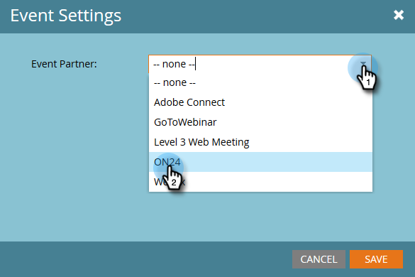

# 設定事件設定並將Marketo與您的網路研討會{#configure-event-settings-and-sync-marketo-with-your-webinar}同步

請依照下列步驟來設定Marketo事件設定，並連線Marketo和ON24。

## 設定事件{#set-the-event}

1. 選擇您要與ON24網路研討會建立關聯的事件，然後按一下「事件動作」下拉式清單，並選取「事件設定」**。******

   

1. 選擇ON24作為活動合作夥伴。

   

1. 選擇登入帳戶（例如顯示名稱）。

   

1. 輸入事件ID（從ON24取得）。 按一下&#x200B;**保存**。

   

   >[!NOTE]
   >
   >在高峰期，ON24可能需要15到20分鐘，才能將活動資訊提供給Marketo。 如果您收到「Invalid Session Id」（無效的作業ID）訊息，請稍後再試。

## 設定計畫{#set-the-schedule}

當您設定與ON24網路研討會相關的事件時，事件排程會填入來自ON24的資料。 要訪問「事件調度」對話框，請遵循以下步驟。

1. 選擇事件。 按一下&#x200B;**事件操作**&#x200B;下拉式清單並選擇&#x200B;**計畫。**

   

1. 選擇&#x200B;**開始日期、結束日期**&#x200B;和&#x200B;**時區**。 按一下&#x200B;**保存**。

   

   >[!NOTE]
   >
   >如果更新ON24中的任何事件資訊，則必須按一下「事件操作」菜單中的「從網路研討會提供程式刷新」**，以查看填入的新資料。**

   [建立子促銷活動和本機資產](create-child-campaigns-and-local-assets.md)

現在，您可以繼續下一個步驟：.

>[!MORELIKETHIS]
>
>* [瞭解Marketo On24適配器事件](understanding-marketo-on24-adapter-events.md)
>* [建立子促銷活動和本機資產](create-child-campaigns-and-local-assets.md)

>

