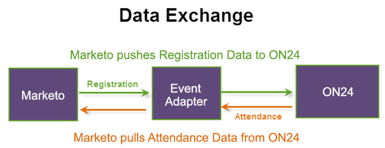

# 在Marketo中建立事件 {#create-an-event-in-marketo}

>[!IMPORTANT]
>
>自2022年8月起，ON24不再支援新的Marketo整合。 本文中的資訊僅適用於現有用戶。

Marketo事件會透過程式追蹤您人員的進展。 它使用ON24適配器推送註冊資訊並提取考勤資訊。 事件會擷取您人員在其中進行時的狀態。

以下是資料交換的方式：

建立Marketo事件時，請選取 **網路研討會** 作為通道類型。 您可以在「管理」中編輯此管道，並建立新管道。 如果建立新管道，則該管道必須為 **網路研討會活動** 讓整合發揮作用。 請參閱 [建立方案管道](/help/marketo/product-docs/administration/tags/create-a-program-channel.md) 以取得更多資訊。

下一步是 [設定事件設定與同步Marketo與網路研討會](/help/marketo/product-docs/demand-generation/events/create-an-event/create-an-event-with-the-marketo-on24-adapter/configure-event-settings-and-sync-marketo-with-your-webinar.md).

>[!MORELIKETHIS]
>
>[了解Marketo ON24適配器事件](/help/marketo/product-docs/demand-generation/events/create-an-event/create-an-event-with-the-marketo-on24-adapter/understanding-marketo-on24-adapter-events.md)
