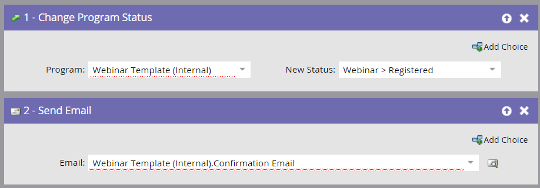

# 建立子促銷活動和本機資產 {#create-child-campaigns-and-local-assets}

使用Design Studio建立您的子促銷活動和本機資產。

## 登錄頁面和表單 {#landing-page-and-form}

為確保人員在ON24中正確註冊，您的Marketo表單中必須包含下列欄位：

* 名字
* 姓氏
* 電子郵件地址

您也可以將下列欄位推送至ON24:

* 公司名稱
* 職稱

在註冊促銷活動中新增正確的流程步驟後，系統會將人員推送至ON24，並標示為已註冊。 您可以新增其他欄位至表單，這些資訊將會在Marketo中擷取，成為人員詳細資料記錄的一部分。

>[!CAUTION]
>
>為了成功整合，您必須使用Marketo表單來註冊您的人員以參加活動，或使用非Marketo表單來搭配適當的API整合，以將註冊資料推送至Marketo。

## 電子郵件和URL代號 {#emails-and-url-tokens}

使用Marketo建立邀請、確認、追蹤和感謝電子郵件。

## Marketo確認電子郵件和URL代號 {#marketo-confirmation-email-and-url-token}

使用Marketo來傳送事件的確認電子郵件。 當人員註冊時，他或她會收到一個唯一URL以用於輸入事件。

>[!NOTE]
>
>若要將此唯一URL填入確認電子郵件，請在電子郵件中使用下列代號： `{{member.webinar url}}`. 當您傳送確認URL時，此Token會自動解析為人員的唯一確認URL。
>
>將確認電子郵件的類型設定為 **操作** 確保註冊者收到其確認資訊，即使他們被取消訂閱亦然。

>[!TIP]
>
>您可以設定ON24以傳送確認、提醒或後續電子郵件。 請參閱 [ON24幫助站點](https://www.on24.com/live-webcast-elite/){target=&quot;_blank&quot;}以取得詳細資訊。

## 註冊子促銷活動要求 {#registration-child-campaign-requirements}

事件包含一或多個子促銷活動，這些活動都可共同作用，讓使用者瀏覽方案狀態，並讓您追蹤事件的效能。

子促銷活動範例包括邀請促銷活動、註冊促銷活動及後續促銷活動。

>[!CAUTION]
>
>您必須建立「註冊」促銷活動，適配器才能執行其工作。 此促銷活動必須由填寫表單的人員觸發，且第一步必須將人員的方案狀態變更為 **已註冊**. 然後，促銷活動會傳送確認電子郵件。 如需詳細資訊，請參閱本文的其餘部分。

**註冊/確認（觸發促銷活動）**

* 智慧清單
* 根據 **填寫表單**. 請務必包含表單所在的登錄頁面，方法是使用 **添加約束**，尤其是在多個登錄頁面上使用相同表單時。

>[!CAUTION]
>
>您必須使用Marketo表單來註冊參加活動的人員，或使用非Marketo表單搭配適當的API整合，才能將註冊資料推送至Marketo。 這對於您的事件合作夥伴整合成功至關重要。

>[!NOTE]
>
>如果您在非Marketo登陸頁面上使用Marketo表單，您的觸發器將會是 **填寫表** 表單名稱。

**流量**

* **更改程式狀態**  — 設為網路研討會 — >已註冊。

設定子促銷活動時，此流程步驟是「第一流程步驟」的必要步驟。 當某人的方案狀態變更為「已註冊」時，Marketo會將註冊資訊推送至ON24。 沒有其他狀態會將該人員推過。

* **傳送電子郵件**  — 確認電子郵件。 將此電子郵件設定為 **操作** 讓已註冊的未訂閱者仍可收到。

此 **傳送電子郵件** 流程步驟必須是第二步。 確認電子郵件包含 `{{member.webinar url}}`，填入從ON24傳回至Marketo的資訊。

>[!NOTE]
>
>由於Marketo中執行動作的順序，這些流程步驟的順序很重要。 此 **更改程式狀態** 步驟會將人員傳送至ON24進行註冊，並產生唯一URL。 發生此情況後，您就可以使用 `{{member.webinar URL}}` 代號。
>
>如果人員因註冊錯誤而傳回，則不會收到電子郵件確認。

下一步是 [測試您的ON24事件整合](/help/marketo/product-docs/demand-generation/events/create-an-event/create-an-event-with-the-marketo-on24-adapter/test-your-on24-event-integration.md){target=&quot;_blank&quot;}。

>[!MORELIKETHIS]
>
>* [了解Marketo ON24適配器事件](/help/marketo/product-docs/demand-generation/events/create-an-event/create-an-event-with-the-marketo-on24-adapter/understanding-marketo-on24-adapter-events.md){target=&quot;_blank&quot;}
>* [ON24事件整合範例](/help/marketo/product-docs/demand-generation/events/create-an-event/create-an-event-with-the-marketo-on24-adapter/example-on24-event-integration.md){target=&quot;_blank&quot;}
>* [了解網路研討會計畫狀態](/help/marketo/product-docs/demand-generation/events/create-an-event/create-an-event-with-the-marketo-on24-adapter/understanding-webinar-program-statuses.md){target=&quot;_blank&quot;}

