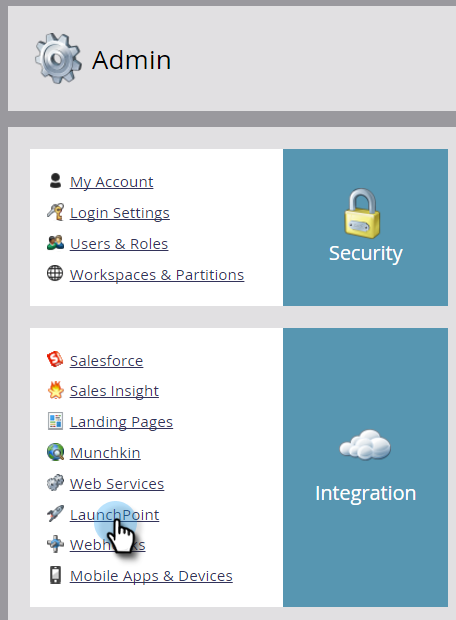

# 在Marketo中輸入您的ON24認證 {#enter-your-on-credentials-in-marketo}

讓我們開始瞭解您的ON24事件整合。 如果您需要編輯或刪除認證，下列也會包含這些步驟。

## 輸入憑據 {#enter-credentials}

1. 登入Marketo，然後按一下「管 **理員**」。

   

1. 在「整合」中，按一 **下LaunchPoint**。

   

1. 在「已安裝服務」下，單 **擊** 「新建」 **和「新建服務」**。

   

1. 在「新建服務」對話框中，輸入以下資訊：

   * **顯示名稱** -輸入要在Marketo中使用的名稱。 如果您共用認證，此名稱可以是您的名稱或群組名稱。
   * **服務** -從下 **拉式選單中** ，選擇On24。

   * **用戶端金鑰** -輸入您用於登入的ON24用戶端金鑰。 用戶端金鑰是32位數字串，包含字母和數字的混合。
   * **用戶端ID** —— 輸入您用於登入的4位數ON24用戶端ID。 您可以直接從ON24帳戶管理員取得用戶端ID和用戶端金鑰。

   

1. 按一下 **建立**。

   

1. 成功驗證憑據後，這些憑據將添加到「已安裝服務」頁。 如果發生錯誤，您將無法儲存憑證。

## 編輯認證 {#edit-credentials}

如果您的密碼過期，或需要變更現有憑證，您可以編輯憑證。

1. 在「已安裝服務」頁籤中，選擇要編輯的憑據，然後按一下「編 **輯服務」**。

   

1. 更新「編輯服務」對話框中的資訊，然後按一下「保 **存**」。

   

## 刪除服務 {#delete-a-service}

1. 在「已安裝服務」頁籤中，選擇要刪除的服務，按一下「服務操 **作** 」下拉清單並選擇 **刪除服務**。

   

1. 按一 **下刪除**。

   

下一步是在ON24 [中建立網路研討會活動](create-your-webinar-event-in-on24.md)。

>[!MORELIKETHIS]
>
>* [瞭解Marketo ON24適配器事件](understanding-marketo-on24-adapter-events.md)

>

