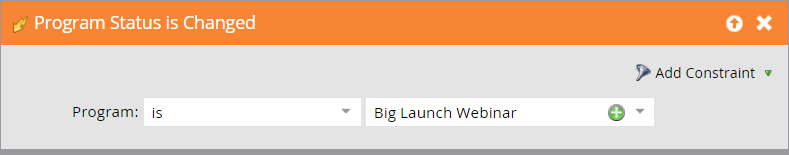

# ON24事件整合範例 {#example-on-event-integration}

以下是ON24網路研討會的範例活動，包括促銷活動。 建立事件時，請務必先測試促銷活動，再執行。

## 在行銷活動中建立新事件 {#create-a-new-event-in-marketing-activities}

1. 選擇 **新增** > **新計畫**.

   

1. 選取 **促銷活動資料夾** 活動的所在位置。

   

1. 輸入 **名稱** 的URL區段。

   

1. 選擇 **事件** 作為 **程式類型**.

   

1. 選擇 **網路研討會** 作為 **管道** 的URL區段。

   

1. 按一下 **建立**。

   

## 邀請（批次促銷活動）  {#invite-batch-campaign}

* **智慧清單**  — 定義您要邀請誰參加活動。
* **流量**

   * 傳送電子郵件 — 如果這是本機資產電子郵件，則會有下列命名慣例：EventName.EmailName。 您也可以使用全域電子郵件。
   * 變更進展狀態 — 設為網路研討會>受邀。

* **排程**  — 設定要傳送邀請的日期。

## 註冊/確認（觸發促銷活動） {#registration-confirmation-trigger-campaign}

* **智慧清單**

   * 根據觸發促銷活動 **填寫表單**. 請務必包含表單所在的登錄頁面，方法是使用 **添加約束**，尤其是如果表單用於多個登陸頁面時。

>[!CAUTION]
>
>您必須使用Marketo表單來註冊事件的人員，或使用非Marketo表單來搭配適當的API整合，將註冊資料推送至Marketo。 這對於事件合作夥伴整合的成功至關重要。 **注意**:如果您在非Marketo登陸頁面上使用Marketo表單，您的觸發器將會是 **填寫表單** 表單名稱。

* **流量**

   * **更改晉升狀態**  — 設為網路研討會>註冊。 **注意**:設定子促銷活動時，需要執行此流程步驟。 當人員的晉升狀態變更為 **已註冊**,Marketo會將註冊資訊推送至ON24。

   * **傳送電子郵件**  — 確認電子郵件(設為 **操作** 讓已註冊的未訂閱者仍然能收到。)

**注意**:如果人員因註冊錯誤而傳回，他們將不會收到電子郵件確認。

## 提醒（批次促銷活動） {#reminder-batch-campaign}

* **智慧清單**  — 使用篩選 **方案成員** 並將狀態設為 **已註冊**.

* **流量**  — 傳送電子郵件（提醒電子郵件）。

**注意**:您可以使用類似的促銷活動來傳送 *不同* 後續電子郵件給受邀但尚未註冊的人。

## 後續促銷活動（批次或觸發促銷活動） {#follow-up-campaign-batch-or-trigger-campaign}

* **智慧清單**  — 根據程式狀態的更改觸發。

* **流量**  — 傳送電子郵件。 根據計畫狀態使用選項發送不同的電子郵件。

>[!MORELIKETHIS]
>
>[了解Marketo ON24適配器事件](/help/marketo/product-docs/demand-generation/events/create-an-event/create-an-event-with-the-marketo-on24-adapter/understanding-marketo-on24-adapter-events.md){target=&quot;_blank&quot;}
