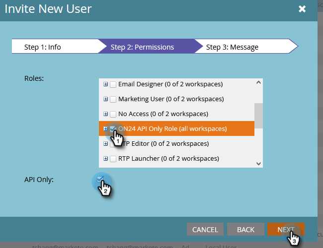

# 設定ON24與Marketo的整合{#set-up-the-on24-integration-with-marketo}

以下說明如何設定ON24事件整合。

## 建立僅API角色 {#create-an-api-only-role}

1. 在「我的Marketo」中，按一下 **管理**.

   

1. 在「安全性」下，按一下 **使用者與角色**.

   

1. 按一下 **角色** 標籤，然後 **新角色**.

   

1. 輸入角色名稱。 開啟 **存取API** 菜單中，並選擇「讀寫自定義對象」和「讀寫人員」。 按一下 **建立**。

   

## 建立新使用者 {#create-a-new-user}

1. 仍然在「使用者與角色」中，按一下 **使用者** 按一下 **邀請新用戶**.

   

1. 輸入新用戶的資訊，然後按一下 **下一個**.

   

1. 選取您剛建立的ON24 API僅限角色。 選取 **僅限API** 核取方塊。 按一下 **下一個**.

   

1. 按一下 **傳送**.

   

>[!NOTE]
>
>僅API使用者不需要邀請。

## 設定ON24連接 {#set-up-on24-connection}

1. 仍在「管理」區段中，按一下 **LaunchPoint**.

   

1. 按一下 **新增** then **新服務**.

   

1. 選擇顯示名稱。 按一下 **服務** 下拉式清單並選取 **自訂**. 輸入說明。 按一下「僅限API使用者」下拉式清單，然後選取您建立的使用者 [在上述步驟中](#create-a-new-user). 按一下 **建立**。

   

1. 找到您剛建立的自訂LaunchPoint服務，然後按一下「檢視詳細資料」。

   

1. 反白顯示、按一下滑鼠右鍵、複製並儲存用戶端ID（您稍後將需要）。 對用戶端密碼重複。

   

1. 在左側的樹中，按一下「Web服務」。

   

1. 在「REST API」底下，反白標示、按一下滑鼠右鍵、複製並儲存身分識別的第一部分（直到.com中的「m」為止）。

   

1. 使用您儲存的用戶端ID、用戶端密碼和身分，導覽至您的ON24帳戶。 其餘步驟將在該處執行，並 [概述](https://on24support.force.com/Support/s/article/Connect-Marketo-ON24-Connect-Data-Integration#Step6){target=&quot;_blank&quot;}。
