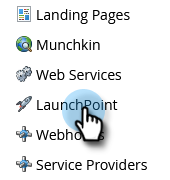

# 設定 ON24 與 Marketo 的整合{#set-up-the-on24-integration-with-marketo}

以下說明如何設定您的ON24事件整合。

## 建立僅限API的角色 {#create-an-api-only-role}

1. 從「我的Marketo」，按一下「**[!UICONTROL Admin]**」。

   

1. 在[!UICONTROL Security]底下，按一下&#x200B;**[!UICONTROL Users & Roles]**。

   

1. 按一下「**[!UICONTROL Roles]**」標籤，然後按&#x200B;**[!UICONTROL New Role]**。

   

1. 輸入[!UICONTROL Role Name]。 開啟&#x200B;**[!UICONTROL Access API]**&#x200B;功能表並選取&quot;[!UICONTROL Read-Write Custom Object]&quot;和&quot;[!UICONTROL Read-Write Person]&quot;。 按一下「**[!UICONTROL Create]**」。

   

## 建立新使用者 {#create-a-new-user}

1. 仍然在[!UICONTROL Users & Roles]中，按一下&#x200B;**[!UICONTROL Users]**&#x200B;索引標籤，然後按一下&#x200B;**[!UICONTROL Invite New User]**。

   

1. 輸入新使用者的資訊並按一下&#x200B;**[!UICONTROL Next]**。

   

1. 選取您剛建立的[!UICONTROL ON24 API Only Role (all workspaces)]。 選取&#x200B;**[!UICONTROL API Only]**&#x200B;核取方塊。 按一下「**[!UICONTROL Next]**」。

   

1. 按一下「**[!UICONTROL Send]**」。

   

>[!NOTE]
>
>僅限API使用者不需要邀請。

## 設定ON24連線 {#set-up-on24-connection}

1. 仍然在[!UICONTROL Admin]區段中，按一下&#x200B;**[!UICONTROL LaunchPoint]**。

   

1. 按一下&#x200B;**[!UICONTROL New]**，然後再按&#x200B;**[!UICONTROL New Service]**。

   

1. 選擇[!UICONTROL display name]。 按一下&#x200B;**[!UICONTROL Service]**&#x200B;下拉式清單，然後選取&#x200B;**[!UICONTROL Custom]**。 輸入[!UICONTROL description]。 按一下[!UICONTROL API Only User]下拉式清單，並選取您在上面的步驟中建立[的使用者](#create-a-new-user)。 按一下「**[!UICONTROL Create]**」。

   

1. 尋找您剛建立的自訂[!DNL LaunchPoint]服務，然後按一下[!UICONTROL View Details]。

   

1. 反白顯示、按一下滑鼠右鍵、複製並儲存[!UICONTROL Client ID] （您稍後會需要）。 重複[!UICONTROL Client Secret]。

   

1. 在左側的樹狀結構中，按一下&#x200B;**[!UICONTROL Web Services]**。

   

1. 在「[!UICONTROL REST API]」下方，反白顯示、按一下滑鼠右鍵、複製並儲存[!UICONTROL Identity]的第一部分（直到.com中的&#39;m&#39;）。

   

1. 使用您儲存的使用者端ID、使用者端密碼和身分識別，導覽至您的ON24帳戶。 其餘步驟均在此執行，可在[ON24檔案](https://support.on24.com/hc/en-us/articles/21420762650523-Data-Integration-Setup-Instructions-When-Using-Marketo-Registration-Option-1){target="_blank"}中找到。
