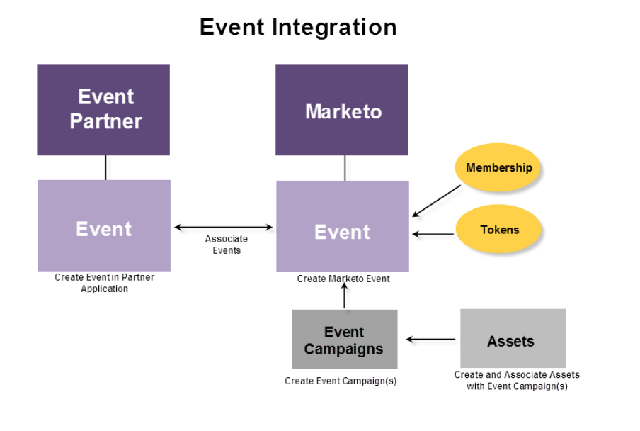

# 瞭解Marketo On24適配器事件 {#understanding-marketo-on-adapter-events}

如果您的ON24網路研討會未連線至Marketo，您必須將已在Marketo中的與會者資訊匯入ON24。 網路研討會後，您必須取得ON24中已有的出席資訊，再將它匯入Marketo。

ON24適配器會為您傳輸所有資訊。 它會將擷取到Marketo登陸頁面的註冊資訊推送至ON24，並自動將出席資訊提取至Marketo活動。

這些文章將引導您完成在ON24中建立網路研討會、在Marketo中建立活動，以及建立活動關聯的程式。

下圖說明整合程式。

準備開始了嗎？ 從使用 [ON24適配器建立事件開始](../../../../../product-docs/demand-generation/events/create-an-event/create-an-event-with-the-marketo-on24-adapter.md)。

>[!NOTE]
>
>**相關文章**
>
>* [使用Marketo ON24適配器建立事件](../../../../../product-docs/demand-generation/events/create-an-event/create-an-event-with-the-marketo-on24-adapter.md)

>

