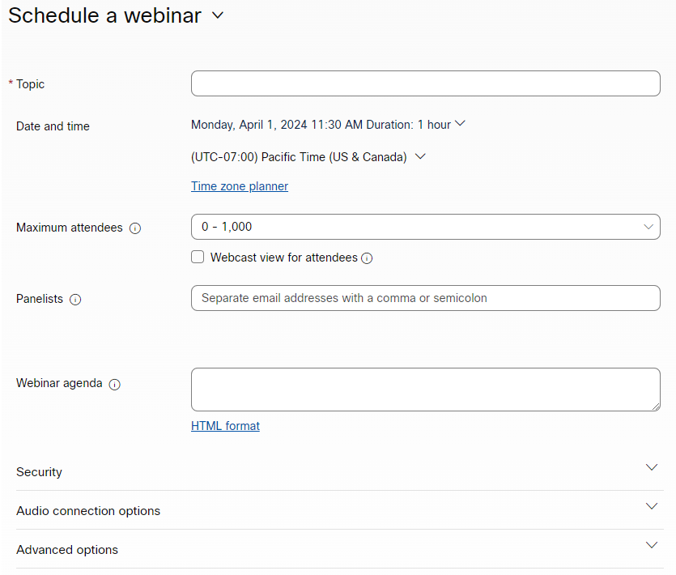

# 使用Webex建立事件 {#create-an-event-with-webex}

>[!PREREQUISITES]
>
>* [將Webex新增為LaunchPoint Service](/help/marketo/product-docs/administration/additional-integrations/add-webex-as-a-launchpoint-service.md)
>* [建立新的事件程式](/help/marketo/product-docs/demand-generation/events/understanding-events/create-a-new-event-program.md)
>* 設定適當的 [流程動作](/help/marketo/product-docs/core-marketo-concepts/smart-campaigns/flow-actions/add-a-flow-step-to-a-smart-campaign.md) 以追蹤參與

## 排程網路研討會 {#schedule-a-webinar}

首先，在中建立網路研討會 [Webex](https://www.webex.com/){target="_blank"}. Marketo Engage only uses specific settings and fields for your integration, which we'll go through shortly. For additional information, please see the [Webex Webinars Help Documentation](https://help.webex.com/en-us/landing/ld-7srxjs-WebexWebinars/Webex-Webinars){target="_blank"}.

>[!NOTE]
>
>您在Webex中選擇您偏好的設定，但在Marketo Engage中只能檢視下列資訊：網路研討會名稱、開始/結束日期和時間、時區和說明。

### 基本資訊 {#basic-information}

* **主題**：這是您的事件名稱，可在Marketo中檢視。
* **日期和時間**：開始/結束日期、開始/結束時間、持續期間和時區都可在Marketo中檢視。
* **出席者上限**：出席者人數上限決定支援的Webex功能。
* **出席者的網路廣播檢視**：核取此專案，讓您的網路研討會直播給所有與會者。
* **小組成員**：邀請特定人員加入您的網路研討會。
* **網路研討會議程**：如果您要在傳送給小組成員的電子郵件邀請中提供內容，請填入此內容。

### 安全性 {#security}

* **網路研討會密碼**：（選擇性）如果您使用此欄位，請務必將其納入確認電子郵件中。
* **小組成員密碼**：（選擇性）如果您使用此欄位，請務必將其納入您的網路研討會議程。
* **需要帳戶**：將出席者限製為僅擁有Webex帳戶的出席者。

### 音訊連線選項 {#audio-connection-options}

* **音訊連線型別**：選擇網路研討會參與者如何加入網路研討會的音訊部分。
* **登入和退出色調**：選取當使用者進入或退出網路研討會時您想要的音效（需要電話音訊連線）。
* **將小組成員設為靜音**：選擇您想要的小組成員靜音設定。

### 進階選項 {#advanced-options}

* **自動錄製**：核取此項以自動錄製您的網路研討會。
* **練習會議**：核取此項以在網路研討會開始時開始練習工作階段。
* **分組工作階段**：分組工作階段可讓您在網路研討會開始前預先指派小組成員和出席者，或讓他們於網路研討會期間加入。
* **網路研討會系列**：新增至網路研討會系列，可讓使用者檢視您的網路研討會（不論是否公開）。
* **註冊**：出席者在出席之前必須先註冊並取得主機核准。
* **電子郵件提醒**：選擇網路研討會開始前15分鐘到兩天內的電子郵件提醒。
* **網路研討會選項**：決定網路研討會參與者可用的功能。
* **參與者許可權**：參與者許可權決定網路研討會參與者可用的動作。

>[!NOTE]
>
>Marketo-Webex整合無法支援從Webex傳送確認電子郵件。 必須透過Marketo傳送確認。 排程事件後，請務必複製事件資訊至Marketo確認電子郵件，並將電子郵件設為 _營運_.

現在我們已準備好開始Marketo Engage了！

## 將您的活動與Marketo Engage同步 {#sync-your-event-with-marketo-engage}

1. 在Marketo中，尋找並選取您建立的事件計畫。 在 **事件動作** 下拉式清單，選取 **事件設定**.

   

   >[!NOTE]
   >
   >所選事件的管道型別必須是 **網路研討會**.

1. 在 **活動合作夥伴** 下拉式清單，選取 **Webex網路研討會**.

   

1. 在 **登入** 從下拉式清單中選擇您的Webex登入資訊。

   

1. 在 **事件** 從下拉式清單中選擇您的Webex事件。

   

1. 您的網路研討會詳細資訊將會填入。 按一下&#x200B;**保存**。

   

您的Webex事件現在會與Marketo事件同步。 註冊您的網路研討會的人將透過 _變更方案狀態_ 當「新狀態」設為「已註冊」時的流程步驟。 沒有其他狀態會將人員推到。 請務必確認 _變更方案狀態_ 流程步驟#1和 _傳送電子郵件_ 流程步驟#2。

## 注意事項 {#things-to-note}

* 避免使用巢狀電子郵件程式來傳送確認電子郵件。 請改用事件程式的Smart Campaign。

* 資料可能需要48小時才會出現在Marketo中。 如果等了這麼久仍未看到任何內容，請按一下 **從網路研討會提供者重新整理** 在 **事件動作** 中的下拉式清單 **摘要** 索引標籤進行識別。
